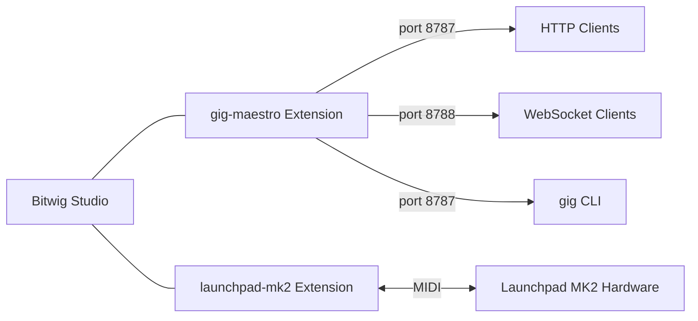

# Bitwig Extensions

Multi-module Gradle project containing Bitwig Studio controller extensions.

## Modules

| Module | Description | Details |
|--------|-------------|---------|
| [gig-maestro](gig-maestro/) | RPC-based Bitwig controller extension with a companion CLI tool | [README](gig-maestro/README.md) |
| [launchpad-mk2](launchpad-mk2/) | Novation Launchpad MK2 controller extension | [README](launchpad-mk2/README.md) |



## Prerequisites

- **Java 21+**
- **Gradle 9.3+** (wrapper included -- use `./gradlew`)
- **Bitwig Studio 6.0+**

## Quick Start

```bash
# Build gig-maestro extension (.bwextension)
./gradlew :gig-maestro:shadowJar

# Build gig-maestro CLI
./gradlew :gig-maestro:cliShadowJar

# Build launchpad-mk2 extension
./gradlew :launchpad-mk2:build

# Build everything
./gradlew clean build

# Run tests
./gradlew :gig-maestro:test
```

## Project Structure

```
extensions/
├── gig-maestro/
│   ├── src/main/java/    # Extension source
│   ├── src/cli/java/     # CLI source
│   ├── src/test/java/    # Tests
│   ├── tools/            # Tool schemas and system prompt
│   ├── scripts/          # Smoke tests
│   └── docs/             # API reference
├── launchpad-mk2/
│   └── src/main/java/    # Extension source
├── build.gradle.kts      # Root build config
├── settings.gradle.kts   # Module declarations
└── gradle/               # Gradle wrapper
```

## License

See individual modules for license details.
