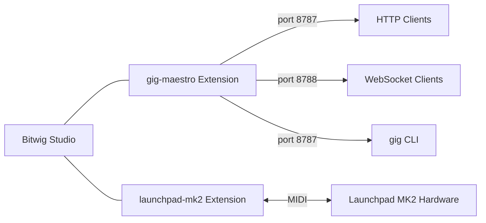

# Bitwig Extensions

Multi-module Gradle project containing custom [Bitwig Studio](https://www.bitwig.com/) controller extensions.

## Modules

| Module | Description | Details |
|--------|-------------|---------|
| [gig-maestro](gig-maestro/) | RPC-based controller extension — control Bitwig via JSON-RPC over HTTP/WebSocket, with a companion CLI and interactive API docs | [README](gig-maestro/README.md) |
| [launchpad-mk2](launchpad-mk2/) | Novation Launchpad MK2 controller extension with RGB clip launcher grid | [README](launchpad-mk2/README.md) |



## Highlights

- **306 RPC methods** across 28 domains — transport, tracks, devices, clips, notes, browser, arranger, mixer, macros, and more
- **CLI tool** with 12 command groups for terminal-based workflows
- **WebSocket streaming** with topic-based subscriptions for real-time state updates
- **Interactive API docs** at `http://localhost:8787/docs` powered by [Scalar](https://scalar.com/) with a live "Try It" playground
- **Device control** for Bitwig instruments, VST2, VST3, and CLAP plugins
- **Macro operations** for programmatic song building, sound design, and automation
- **713 automated tests** — unit tests, smoke tests (offline + online), and OpenAPI spec validation

## Prerequisites

- **Java 21+**
- **Gradle 9.3+** (wrapper included — use `./gradlew`)
- **Bitwig Studio 6.0+**
- **Node.js 18+** (for OpenAPI spec generation)

## Quick Start

```bash
# Clone and build
git clone https://github.com/gregrossdev/bitwig-extensions.git
cd bitwig-extensions

# Build gig-maestro extension (.bwextension)
./gradlew :gig-maestro:shadowJar

# Build gig-maestro CLI
./gradlew :gig-maestro:cliShadowJar

# Build launchpad-mk2 extension
./gradlew :launchpad-mk2:build

# Build everything
./gradlew clean build

# Run tests
./gradlew :gig-maestro:test
```

After building, enable the extension in Bitwig: **Settings > Controllers > Add Controller > Greg Ross > Gig Maestro**.

Then try it:

```bash
# Get a full session snapshot
curl -s http://localhost:8787/rpc \
  -d '{"jsonrpc":"2.0","method":"session/snapshot","params":{},"id":1}' | jq .result

# Or use the CLI
gig transport play
gig --pretty snapshot

# Open interactive API docs in your browser
open http://localhost:8787/docs
```

## Documentation

| Resource | Description |
|----------|-------------|
| [gig-maestro README](gig-maestro/README.md) | Architecture, setup, quick start, user stories |
| [CLI Reference](gig-maestro/docs/cli-reference.md) | All 12 CLI commands with options and examples |
| [RPC API Reference](gig-maestro/docs/rpc-api-reference.md) | All 306 methods with parameters |
| [Interactive API Docs](http://localhost:8787/docs) | Scalar-powered browser with live "Try It" (requires Bitwig) |
| [launchpad-mk2 README](launchpad-mk2/README.md) | Button map, LED colors, setup guide |

## Project Structure

```
bitwig-extensions/
├── gig-maestro/
│   ├── src/main/java/    # Extension source (21 handlers)
│   ├── src/cli/java/     # CLI source (PicoCLI)
│   ├── src/test/java/    # JUnit 5 tests (24+ classes)
│   ├── tools/            # Claude tool schemas + system prompt
│   ├── scripts/          # Smoke test suite
│   └── docs/             # API reference + interactive docs
├── launchpad-mk2/
│   └── src/main/java/    # Launchpad MK2 extension
├── build.gradle.kts      # Root build config
├── settings.gradle.kts   # Module declarations
└── gradle/               # Gradle wrapper
```

## Tech Stack

| Component | Technology |
|-----------|------------|
| Language | Java 21 |
| Build | Gradle 9.3.1 (Kotlin DSL, Shadow plugin) |
| Bitwig API | Controller Extension API v25 |
| JSON | Gson |
| WebSocket | Java-WebSocket |
| CLI | PicoCLI |
| API Docs | Scalar (OpenAPI 3.1) |
| Testing | JUnit 5, Mockito, shell-based smoke tests |

## License

MIT
