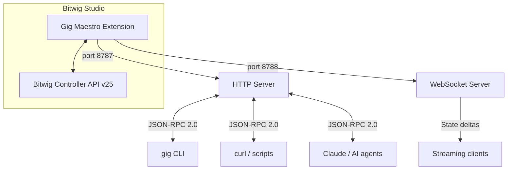
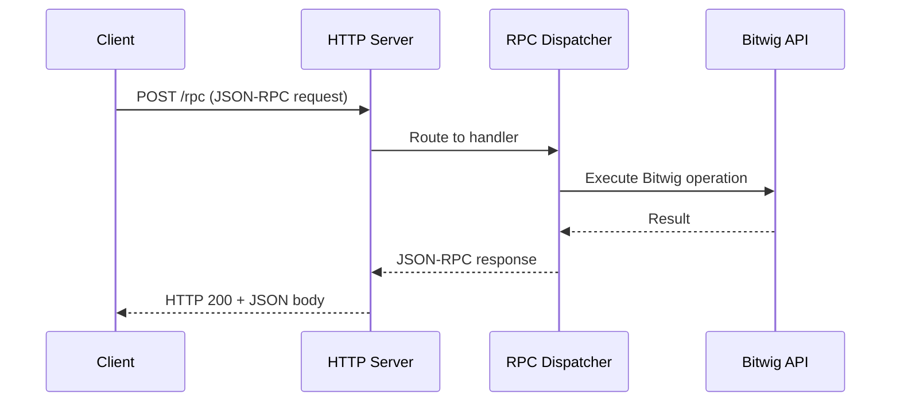
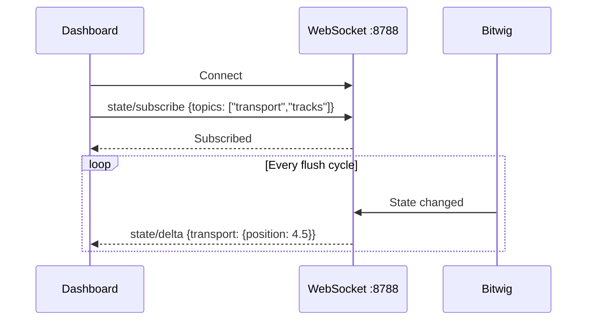
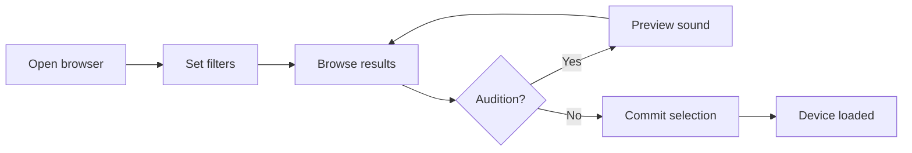

# Gig Maestro

RPC-based controller extension for Bitwig Studio.

Control Bitwig Studio programmatically via JSON-RPC 2.0 over HTTP and WebSocket.
Send commands from the CLI, curl, Claude, or any HTTP client to automate
transport, tracks, devices, clips, notes, mixing, browsing, and more.

## Architecture



The extension runs inside Bitwig as a controller script. It starts an HTTP
server accepting JSON-RPC 2.0 requests and a WebSocket server for real-time
state subscriptions. Local authenticated clients connect over loopback to read
and manipulate the Bitwig session. Gig Maestro does not listen on LAN interfaces.

### Request Flow



## Features

- **200+ RPC methods** across 25+ domains: transport, track, device, clip,
  note, browser, arranger, mixer, project, macro, state, and more
- **CLI tool** with 12 commands for terminal-based workflows
- **WebSocket streaming** with topic-based subscriptions for real-time state
  updates (transport position, track meters, parameter changes)
- **Device control** for Bitwig instruments, VST2, VST3, and CLAP plugins
- **Macro operations** for song building, sound design, and automation
- **Session snapshots** capturing full project state in a single call
- **Browser integration** for searching and loading presets, samples, and devices

## Prerequisites

- Java 21 or later
- Bitwig Studio 6.0 or later

## Build and Install

All commands run from the repository root.

Build the extension:

```sh
./gradlew :gig-maestro:shadowJar
```

Build the CLI:

```sh
./gradlew :gig-maestro:cliShadowJar
```

The extension JAR is output directly to the Bitwig Extensions directory.

Create the local bearer token before enabling the extension:

```sh
mkdir -p ~/.gig-maestro
openssl rand -hex 32 > ~/.gig-maestro/token
chmod 600 ~/.gig-maestro/token
```

The extension refuses to start its servers when the token is missing or shorter
than 32 characters. The CLI reads the same token file automatically.

To enable it in Bitwig:

1. Open Bitwig Studio
2. Go to **Settings** > **Controllers**
3. Click **Add Controller**
4. Select **Greg Ross** > **Gig Maestro**

## Quick Start

Once the extension is enabled in Bitwig, the HTTP server starts on port 8787.

**Get a session snapshot** (full project state):

```sh
curl -s http://localhost:8787/rpc \
  -H "Authorization: Bearer $(<~/.gig-maestro/token)" \
  -d '{"jsonrpc":"2.0","method":"session/snapshot","params":{},"id":1}' | jq .result
```

**Start playback:**

```sh
curl -s http://localhost:8787/rpc \
  -H "Authorization: Bearer $(<~/.gig-maestro/token)" \
  -d '{"jsonrpc":"2.0","method":"transport/play","params":{},"id":1}'
```

**Using the CLI:**

```sh
gig transport play
gig transport stop
gig --pretty snapshot
gig track set-volume -i 0 -v 0.8
gig watch --topics transport
```

## User Stories

### Automate a recording session

> *As a producer, I want to set up my session from the terminal so I can start
> recording without touching the mouse.*

```sh
# Create tracks
gig track create-instrument -p 0
gig track rename "Drums"
gig track create-instrument -p 1
gig track rename "Bass"
gig track create-audio -p 2
gig track rename "Vocals"

# Set tempo and arm the vocal track
gig transport tempo 95.0
gig track set-arm -i 2 on

# Set loop range and start recording
gig rpc '{"jsonrpc":"2.0","method":"transport/setLoopRange","params":{"start":0,"length":16,"enabled":true},"id":1}'
gig transport record
```

### Monitor live state from a dashboard

> *As a developer, I want to stream real-time state changes so I can build
> a custom dashboard showing transport position and track levels.*

```sh
# Watch only transport and track updates
gig --pretty watch --topics transport,tracks
```



### Build a song programmatically

> *As an AI agent (Claude), I want to compose a multi-track arrangement by
> calling macro operations so I can generate music from a text description.*

```sh
# Use the macro/buildSong RPC to create an entire arrangement
curl -s http://localhost:8787/rpc \
  -H "Authorization: Bearer $(<~/.gig-maestro/token)" \
  -d '{
  "jsonrpc":"2.0",
  "method":"macro/buildSong",
  "params":{
    "tracks":[
      {"name":"Kick","type":"instrument","device":"Drum Machine",
       "clips":[{"slot":0,"notes":[{"x":0,"y":36,"velocity":100,"duration":0.5}]}]},
      {"name":"Bass","type":"instrument","device":"Polymer",
       "clips":[{"slot":0,"notes":[{"x":0,"y":36,"velocity":90,"duration":1.0}]}]}
    ]
  },
  "id":1
}'
```

### Browse and load presets

> *As a sound designer, I want to search for presets by category and audition
> them before committing.*



```sh
gig rpc '{"jsonrpc":"2.0","method":"browser/browsePresets","params":{},"id":1}'
gig rpc '{"jsonrpc":"2.0","method":"browser/setShouldAudition","params":{"enabled":true},"id":1}'
gig rpc '{"jsonrpc":"2.0","method":"browser/selectNextFile","params":{},"id":1}'
gig rpc '{"jsonrpc":"2.0","method":"browser/commit","params":{},"id":1}'
```

## Documentation

- **[Interactive API Docs](http://localhost:8787/docs)** -- browse all 306 methods with live "Try It" playground (requires Bitwig running)
- [CLI Reference](docs/cli-reference.md) -- all CLI commands, flags, and usage examples
- [RPC API Reference](docs/rpc-api-reference.md) -- every RPC method with parameters and responses
- [OpenAPI Spec](docs/openapi.json) -- machine-readable API definition (OpenAPI 3.1)

The interactive docs are also available as a [static HTML page](docs/api.html) that can be opened locally.

Authorize the interactive docs with the contents of `~/.gig-maestro/token`
before using **Try It**.

## Security

- HTTP and WebSocket servers bind only to the operating system loopback address.
- RPC, health, documentation, and WebSocket access require the local bearer token.
- Cross-origin access is not enabled.
- Keep `~/.gig-maestro/token` private and never commit it.

## Testing

**Unit tests** (no Bitwig required):

```sh
./gradlew :gig-maestro:test
```

24+ JUnit 5 test classes covering RPC handlers, validation, and serialization.

**Smoke tests** (automated integration scripts):

```sh
# All tests (requires Bitwig running)
gig-maestro/scripts/smoke-test.sh

# Offline only (schema validation, build checks)
gig-maestro/scripts/smoke-test.sh --offline

# Online only (requires Bitwig running)
gig-maestro/scripts/smoke-test.sh --online

# List available test scripts
gig-maestro/scripts/smoke-test.sh --list

# Run a specific test
gig-maestro/scripts/smoke-test.sh --only transport
```

## Tech Stack

| Component | Technology |
|-----------|------------|
| Language | Java 21 |
| Bitwig API | Controller API v25 |
| JSON serialization | Gson |
| WebSocket server | Java-WebSocket |
| CLI framework | PicoCLI |
| Testing | JUnit 5 |
| Build | Gradle (Shadow plugin) |

## Configuration

The CLI reads configuration from `~/.gig-maestro/config.json`. This file is
created automatically on first use and stores connection settings (host, port).
