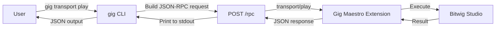

# Gig Maestro CLI Reference

The `gig` command-line tool controls Bitwig Studio remotely via JSON-RPC. It communicates with the Gig Maestro controller extension running inside Bitwig over HTTP (port 8787) and WebSocket (port 8788).

**Version:** gig-cli 0.3.0

### How the CLI Works



### User Stories

**Quick session control from the terminal:**

> *I want to control playback, adjust levels, and manage tracks without
> leaving my terminal or IDE.*

```bash
gig transport play                     # start playback
gig transport tempo 128.0              # set BPM
gig track set-volume -i 0 -v 0.7      # lower track 0
gig track set-mute -i 3 on            # mute track 3
gig --pretty snapshot                  # inspect full state
```

**Export and restore a session:**

> *I want to save my entire Bitwig session as JSON so I can version it
> or rebuild it later.*

```bash
gig song dump -o my-session.json       # export
# ... make changes ...
gig song rebuild                       # restore
```

**Live monitoring during a performance:**

> *I want to see real-time transport and device changes streamed to my
> terminal during a live set.*

```bash
gig --pretty watch --topics transport,device
```

## Building and Installing

```bash
# Build the CLI JAR
./gradlew :gig-maestro:cliShadowJar

# The output JAR is at gig-maestro/build/libs/gig-cli.jar
# Create an alias for convenience
alias gig='java -jar /path/to/gig-cli.jar'
```

## Global Options

| Option | Default | Description |
|---|---|---|
| `--host <host>` | `localhost` | Server host where Gig Maestro is running |
| `--port <port>` | `8787` | Server HTTP port |
| `--pretty` | off | Pretty-print JSON output |
| `--help` | | Show help message and exit |
| `--version` | | Print version info and exit |

Global options must appear **before** the command name:

```bash
gig --host 192.168.1.10 --port 9000 --pretty transport play
```

## Configuration

The CLI reads defaults from `~/.gig-maestro/config.json` when present. CLI flags always override config values.

```json
{
  "host": "localhost",
  "port": 8787
}
```

If the config file is missing or malformed, the CLI silently falls back to built-in defaults.

## Command Tree

```
gig
├── transport    Transport controls
├── track        Track controls
├── device       Device controls
├── note         Note editing
├── snapshot     Session snapshot
├── rpc          Raw JSON-RPC request
├── song         Song dump/rebuild
├── scene        Scene controls
├── action       Application actions
├── mixer        Mixer controls
├── project      Project controls
└── watch        WebSocket state streaming
```

---

## transport

Transport controls (play, stop, record, tempo, etc.).

### Subcommands

| Subcommand | Synopsis | Description |
|---|---|---|
| `play` | `gig transport play` | Start playback |
| `stop` | `gig transport stop` | Stop playback |
| `record` | `gig transport record` | Toggle recording |
| `toggle` | `gig transport toggle` | Toggle play/stop |
| `rewind` | `gig transport rewind` | Rewind the playhead |
| `ff` | `gig transport ff` | Fast-forward the playhead |
| `tap-tempo` | `gig transport tap-tempo` | Tap tempo |
| `tempo` | `gig transport tempo <BPM>` | Set tempo in BPM |
| `position` | `gig transport position <beats>` | Set playhead position in beats |
| `loop` | `gig transport loop <on\|off>` | Enable/disable arranger loop |
| `metronome` | `gig transport metronome <on\|off>` | Enable/disable metronome |

### Options

**tempo**

| Argument | Type | Required | Description |
|---|---|---|---|
| `<BPM>` | double | yes | Tempo in BPM (e.g., 120.0) |

**position**

| Argument | Type | Required | Description |
|---|---|---|---|
| `<beats>` | double | yes | Position in beats |

**loop / metronome**

| Argument | Type | Required | Description |
|---|---|---|---|
| `<on\|off>` | string | yes | Enable (`on`) or disable (`off`) |

### Examples

```bash
# Start playback
gig transport play

# Set tempo to 140 BPM
gig transport tempo 140.0

# Jump to beat 16 and enable loop
gig transport position 16.0
gig transport loop on
```

---

## track

Track controls (volume, pan, mute, solo, arm, create, select, rename, delete, duplicate).

### Subcommands

| Subcommand | Synopsis | Description |
|---|---|---|
| `set-volume` | `gig track set-volume -i <index> -v <value>` | Set track volume (0.0--1.0) |
| `set-pan` | `gig track set-pan -i <index> -v <value>` | Set track pan (0.0=left, 0.5=center, 1.0=right) |
| `set-mute` | `gig track set-mute -i <index> <on\|off>` | Mute or unmute a track |
| `set-solo` | `gig track set-solo -i <index> <on\|off>` | Solo or unsolo a track |
| `set-arm` | `gig track set-arm -i <index> <on\|off>` | Arm or disarm a track for recording |
| `create-audio` | `gig track create-audio [-p <position>]` | Create a new audio track |
| `create-instrument` | `gig track create-instrument [-p <position>]` | Create a new instrument track |
| `create-effect` | `gig track create-effect [-p <position>]` | Create a new effect track |
| `select` | `gig track select -i <index>` | Select a track by index (0--63) |
| `rename` | `gig track rename <name>` | Rename the currently selected track |
| `delete-selected` | `gig track delete-selected` | Delete the currently selected track |
| `duplicate` | `gig track duplicate` | Duplicate the currently selected track |

### Options

**set-volume / set-pan**

| Option | Short | Type | Required | Description |
|---|---|---|---|---|
| `--index` | `-i` | int | yes | Track index (0-based) |
| `--value` | `-v` | double | yes | Value (0.0--1.0) |

**set-mute / set-solo / set-arm**

| Option | Short | Type | Required | Description |
|---|---|---|---|---|
| `--index` | `-i` | int | yes | Track index (0-based) |
| `<on\|off>` | | string | yes | Toggle state |

**create-audio / create-instrument / create-effect**

| Option | Short | Type | Default | Description |
|---|---|---|---|---|
| `--position` | `-p` | int | -1 (append) | Insert position (0-based index, -1 to append) |

**select**

| Option | Short | Type | Required | Description |
|---|---|---|---|---|
| `--index` | `-i` | int | yes | Track index (0-based) |

**rename**

| Argument | Type | Required | Description |
|---|---|---|---|
| `<name>` | string | yes | New track name |

### Examples

```bash
# Set track 0 volume to 80%
gig track set-volume -i 0 -v 0.8

# Mute track 2
gig track set-mute -i 2 on

# Create an instrument track at position 1
gig track create-instrument -p 1

# Select track 0, rename it, then duplicate
gig track select -i 0
gig track rename "Lead Synth"
gig track duplicate
```

---

## device

Device controls (insert, list, remove).

### Subcommands

| Subcommand | Synopsis | Description |
|---|---|---|
| `insert-bitwig` | `gig device insert-bitwig <name> [-p <position>]` | Insert a built-in Bitwig device by name |
| `insert-plugin` | `gig device insert-plugin <type> <id> [-p <position>]` | Insert a third-party plugin (VST2, VST3, CLAP) |
| `list-bitwig` | `gig device list-bitwig` | List all available built-in Bitwig devices |
| `remove` | `gig device remove` | Remove the currently selected device |

### Options

**insert-bitwig**

| Argument/Option | Type | Required | Default | Description |
|---|---|---|---|---|
| `<name>` | string | yes | | Device name (e.g., `Polymer`, `EQ-5`) |
| `--position`, `-p` | string | no | `end` | Insert position: `end`, `before`, `after` |

**insert-plugin**

| Argument/Option | Type | Required | Default | Description |
|---|---|---|---|---|
| `<type>` | string | yes | | Plugin type: `vst2`, `vst3`, `clap` |
| `<id>` | string | yes | | Plugin ID |
| `--position`, `-p` | string | no | `end` | Insert position: `end`, `before`, `after` |

### Examples

```bash
# List available Bitwig devices
gig device list-bitwig

# Insert EQ-5 at the end of the device chain
gig device insert-bitwig EQ-5

# Insert a VST3 plugin before the selected device
gig device insert-plugin vst3 "com.fabfilter.Pro-Q.3" -p before

# Remove the selected device
gig device remove
```

---

## note

Note editing controls (select clip, write/read/clear notes, grid settings).

### Subcommands

| Subcommand | Synopsis | Description |
|---|---|---|
| `select` | `gig note select -t <track> -s <slot>` | Select a clip slot for note editing |
| `delete` | `gig note delete -t <track> -s <slot>` | Delete a clip from a clip launcher slot |
| `set-notes` | `gig note set-notes -j <json>` | Write notes into the selected clip |
| `clear-note` | `gig note clear-note --x <x> --y <y>` | Clear a single note at the given position |
| `clear-all` | `gig note clear-all` | Clear all notes from the selected clip |
| `get-notes` | `gig note get-notes` | Read all notes in the selected clip's viewport |
| `set-step-size` | `gig note set-step-size -s <size>` | Set step grid resolution |
| `scroll-steps` | `gig note scroll-steps -o <offset>` | Scroll the step grid viewport |

### Options

**select / delete**

| Option | Short | Type | Required | Description |
|---|---|---|---|---|
| `--track-index` | `-t` | int | yes | Track index (0-based) |
| `--slot-index` | `-s` | int | yes | Slot index (0-based) |

**set-notes**

| Option | Short | Type | Required | Description |
|---|---|---|---|---|
| `--json` | `-j` | string | yes | JSON array of notes: `[{x, y, velocity, duration}, ...]` |

**clear-note**

| Option | Type | Required | Description |
|---|---|---|---|
| `--x` | int | yes | Step position (0-based) |
| `--y` | int | yes | MIDI note number (0--127) |

**set-step-size**

| Option | Short | Type | Required | Description |
|---|---|---|---|---|
| `--size` | `-s` | double | yes | Step size in beat time (0.25=1/16, 0.5=1/8, 1.0=1/4) |

**scroll-steps**

| Option | Short | Type | Required | Description |
|---|---|---|---|---|
| `--offset` | `-o` | int | yes | Step offset (0-based) |

### Examples

```bash
# Select clip at track 0, slot 0
gig note select -t 0 -s 0

# Write a C4 quarter note at step 0, velocity 100
gig note set-notes -j '[{"x":0,"y":60,"velocity":100,"duration":1.0}]'

# Read back all notes
gig --pretty note get-notes

# Set grid to 1/16 resolution and clear all
gig note set-step-size -s 0.25
gig note clear-all
```

---

## snapshot

Get the current session snapshot from Bitwig Studio. Returns a JSON object with transport state, track info, device state, and more.

This command has no subcommands or arguments.

### Synopsis

```bash
gig snapshot
```

### Examples

```bash
# Get session snapshot with pretty output
gig --pretty snapshot
```

---

## rpc

Send a raw JSON-RPC 2.0 request to Gig Maestro. Useful for accessing methods not yet covered by dedicated commands.

### Synopsis

```bash
gig rpc '<json-rpc-request>'
```

| Argument | Type | Required | Description |
|---|---|---|---|
| `<request>` | string | yes | Raw JSON-RPC request body |

### Examples

```bash
# Send a raw transport/play request
gig rpc '{"jsonrpc":"2.0","method":"transport/play","params":{},"id":1}'

# Pretty-print a raw snapshot request
gig --pretty rpc '{"jsonrpc":"2.0","method":"session/snapshot","params":{},"id":1}'
```

---

## song

Song dump and rebuild operations. Export the entire Bitwig session to JSON or rebuild a session from a previously exported file.

### Subcommands

| Subcommand | Synopsis | Description |
|---|---|---|
| `dump` | `gig song dump [-o <path>]` | Export the current session to a song JSON file |
| `rebuild` | `gig song rebuild` | Rebuild the session from a dumped JSON file |

### Options

**dump**

| Option | Short | Type | Default | Description |
|---|---|---|---|---|
| `--output` | `-o` | string | stdout | Output file path |

### Examples

```bash
# Dump session to stdout
gig --pretty song dump

# Dump session to a file
gig song dump -o my-session.json

# Rebuild a session from a dump
gig song rebuild
```

---

## scene

Scene controls (list, launch, create, delete, rename, set-color).

### Subcommands

| Subcommand | Synopsis | Description |
|---|---|---|
| `list` | `gig scene list` | List scenes (scroll info) |
| `launch` | `gig scene launch <index>` | Launch a scene by index |
| `create` | `gig scene create` | Create a new scene |
| `create-from-playing` | `gig scene create-from-playing` | Create a scene from currently playing clips |
| `delete` | `gig scene delete <index>` | Delete a scene by index |
| `rename` | `gig scene rename <index> <name>` | Rename a scene |
| `set-color` | `gig scene set-color <index> <color>` | Set the color of a scene |

### Options

**launch / delete**

| Argument | Type | Required | Description |
|---|---|---|---|
| `<index>` | int | yes | Scene index (0-based) |

**rename**

| Argument | Type | Required | Description |
|---|---|---|---|
| `<index>` | int | yes | Scene index (0-based) |
| `<name>` | string | yes | New scene name |

**set-color**

| Argument | Type | Required | Description |
|---|---|---|---|
| `<index>` | int | yes | Scene index (0-based) |
| `<color>` | string | yes | Color value |

### Examples

```bash
# List all scenes
gig --pretty scene list

# Launch scene 0
gig scene launch 0

# Create a scene from playing clips and rename it
gig scene create-from-playing
gig scene rename 0 "Verse A"
```

---

## action

Application action controls (list, categories, invoke). Actions are Bitwig Studio operations that can be triggered by ID.

### Subcommands

| Subcommand | Synopsis | Description |
|---|---|---|
| `list` | `gig action list [--category <cat>]` | List available actions, optionally filtered by category |
| `categories` | `gig action categories` | List action categories |
| `invoke` | `gig action invoke <id>` | Invoke an action by ID |

### Options

**list**

| Option | Type | Required | Description |
|---|---|---|---|
| `--category` | string | no | Filter actions by category name |

**invoke**

| Argument | Type | Required | Description |
|---|---|---|---|
| `<id>` | string | yes | Action ID to invoke |

### Examples

```bash
# List all action categories
gig --pretty action categories

# List actions in the "Transport" category
gig --pretty action list --category Transport

# Invoke an action by ID
gig action invoke "Select All"
```

---

## mixer

Mixer panel controls (sections, zoom, state).

### Subcommands

| Subcommand | Synopsis | Description |
|---|---|---|
| `get-state` | `gig mixer get-state` | Get the current mixer state |
| `set-section` | `gig mixer set-section <section> <on\|off>` | Show or hide a mixer section |
| `zoom-in` | `gig mixer zoom-in` | Zoom in all mixer channels |
| `zoom-out` | `gig mixer zoom-out` | Zoom out all mixer channels |

### Options

**set-section**

| Argument | Type | Required | Description |
|---|---|---|---|
| `<section>` | string | yes | Section name: `meter`, `io`, `sends`, `clipLauncher`, `devices`, `crossFade` |
| `<on\|off>` | string | yes | Visibility: `on` to show, `off` to hide |

### Examples

```bash
# Get the current mixer state
gig --pretty mixer get-state

# Show the sends section, hide the meter section
gig mixer set-section sends on
gig mixer set-section meter off

# Zoom in all channels
gig mixer zoom-in
```

---

## project

Project-level controls (state, mute/solo/arm resets, cue settings).

### Subcommands

| Subcommand | Synopsis | Description |
|---|---|---|
| `get-state` | `gig project get-state` | Get the current project state |
| `unmute-all` | `gig project unmute-all` | Unmute all tracks |
| `unsolo-all` | `gig project unsolo-all` | Unsolo all tracks |
| `unarm-all` | `gig project unarm-all` | Unarm all tracks |
| `set-cue-volume` | `gig project set-cue-volume <vol>` | Set the cue/preview volume (0.0--1.0) |
| `set-cue-mix` | `gig project set-cue-mix <mix>` | Set the cue/preview mix (0.0--1.0) |

### Options

**set-cue-volume**

| Argument | Type | Required | Description |
|---|---|---|---|
| `<vol>` | double | yes | Volume level (0.0--1.0) |

**set-cue-mix**

| Argument | Type | Required | Description |
|---|---|---|---|
| `<mix>` | double | yes | Mix level (0.0--1.0) |

### Examples

```bash
# Check project state
gig --pretty project get-state

# Reset all track states
gig project unmute-all
gig project unsolo-all
gig project unarm-all

# Set cue volume to 50%
gig project set-cue-volume 0.5
```

---

## watch

Stream state changes from Bitwig Studio via WebSocket. Connects to port 8788 (HTTP port + 1) and prints each state update as a JSON line to stdout. Runs until interrupted with Ctrl+C.

### Synopsis

```bash
gig watch [--topics <t1>,<t2>,...]
```

### Options

| Option | Type | Default | Description |
|---|---|---|---|
| `--topics` | string (comma-separated) | all topics | Topic filter (e.g., `transport`, `device`) |

### Examples

```bash
# Watch all state changes
gig --pretty watch

# Watch only transport and device changes
gig --pretty watch --topics transport,device
```

Connection status messages are printed to stderr:

```
Connected to ws://localhost:8788 (topics: [transport, device])
```

---

## Output Format

All commands return JSON. By default, output is compact single-line JSON:

```bash
$ gig transport play
{"status":"ok"}
```

Use `--pretty` for indented, human-readable output:

```bash
$ gig --pretty transport play
{
  "status": "ok"
}
```

The `watch` command outputs one JSON object per line (NDJSON), or pretty-printed objects when `--pretty` is set.

## Error Handling

Errors are printed to **stderr** and the process exits with code **1**.

```bash
$ gig transport play
Error: Connection refused
$ echo $?
1
```

Common error scenarios:

| Error | Cause |
|---|---|
| `Connection refused` | Bitwig Studio is not running or Gig Maestro extension is not active |
| `RPC error -32601: Method not found` | The method name is invalid or not implemented |
| `RPC error -32602: Invalid params` | Required parameters are missing or have wrong types |
| `RPC error -32603: Internal error` | Server-side error inside the extension |

When a JSON-RPC error is returned, the CLI formats it as:

```
Error: RPC error <code>: <message>
```
