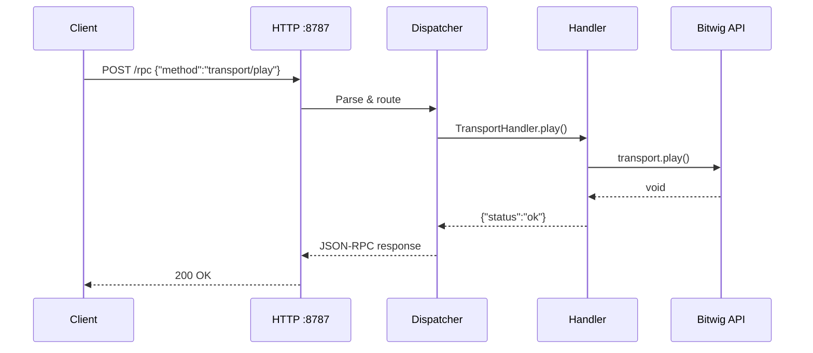
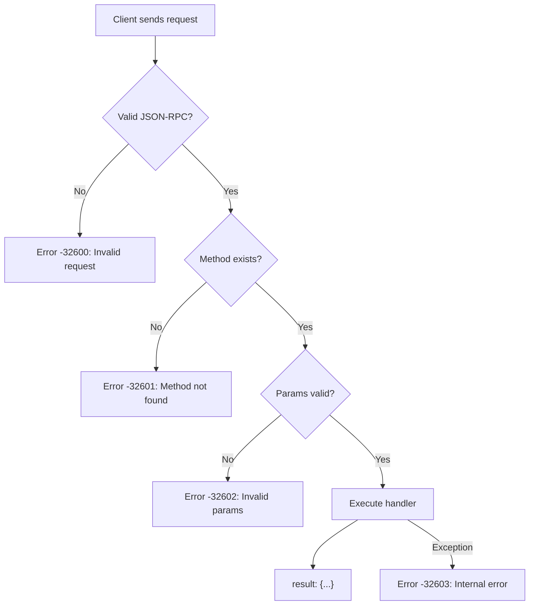
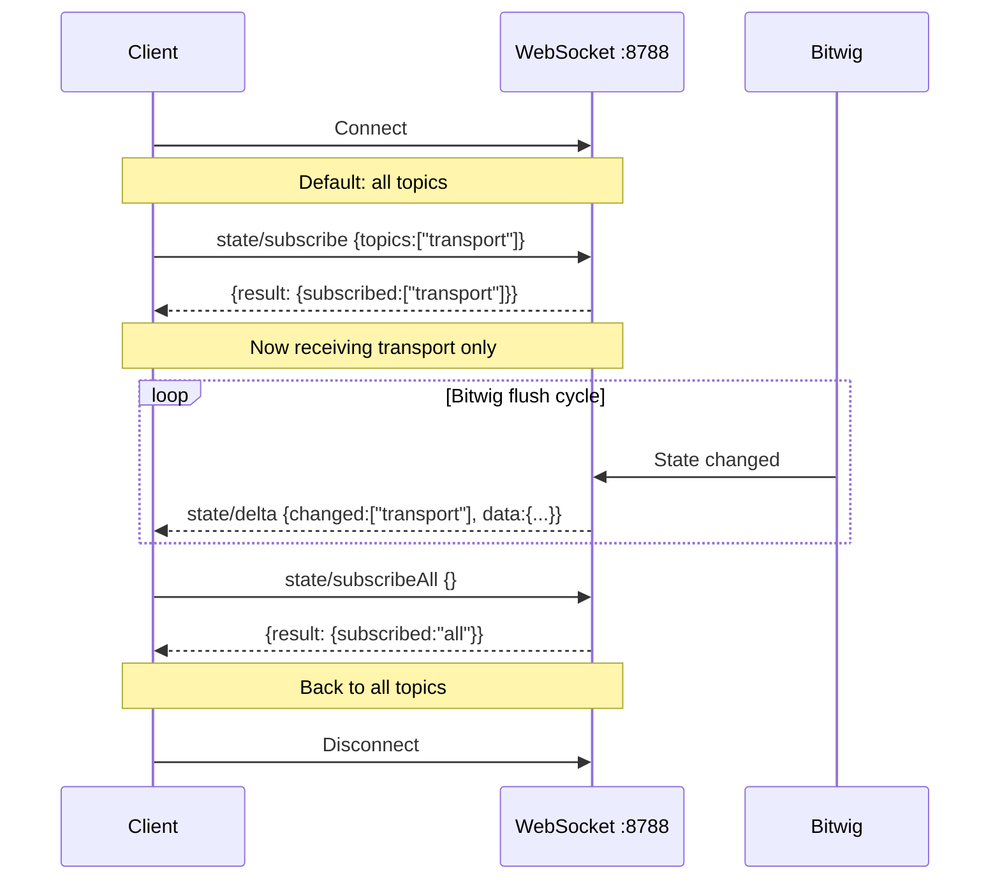
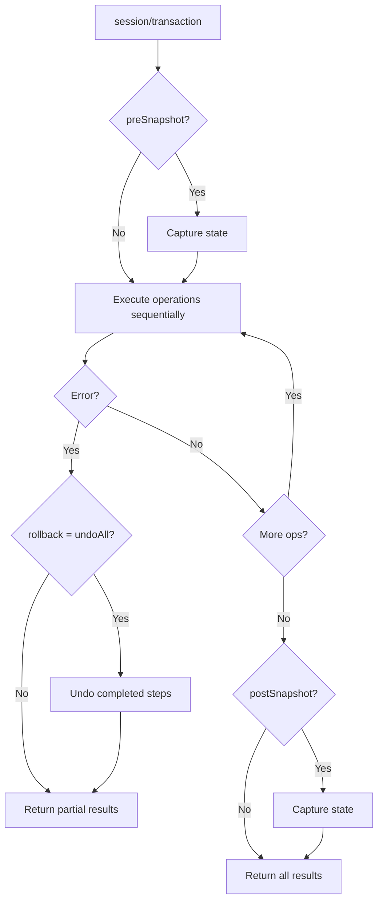

# Gig Maestro RPC API Reference

Complete reference for all JSON-RPC methods exposed by the Gig Maestro Bitwig Studio controller extension.

---

## Introduction

### Protocol

Gig Maestro uses **JSON-RPC 2.0** over HTTP for synchronous request/response communication, and WebSocket for real-time state streaming.

### HTTP Endpoint

```
POST http://localhost:8787/rpc
Content-Type: application/json
```

### Request Format

```json
{
  "jsonrpc": "2.0",
  "method": "<domain>/<methodName>",
  "params": { ... },
  "id": 1
}
```

- `method` -- RPC method name using `domain/action` convention (e.g., `transport/play`, `track/setVolume`).
- `params` -- Object containing method parameters. Omit or use `{}` for parameterless methods.
- `id` -- Integer request identifier. Responses echo this value for correlation.

### Response Format (Success)

```json
{
  "jsonrpc": "2.0",
  "result": { ... },
  "id": 1
}
```

### Response Format (Error)

```json
{
  "jsonrpc": "2.0",
  "error": {
    "code": -32600,
    "message": "Invalid request"
  },
  "id": 1
}
```

Standard JSON-RPC error codes apply. Application-specific errors use codes in the `-32000` to `-32099` range.

### Method Naming Convention

Tool names in this document use underscores (e.g., `transport_play`) which map to RPC method names with slashes (e.g., `transport/play`). When making HTTP requests, always use the slash form.

### Request / Response Flow



### Error Flow



---

## WebSocket Streaming

### Endpoint

```
ws://localhost:8788/
```

### Overview

The WebSocket connection provides real-time push notifications whenever Bitwig Studio state changes. Notifications are sent as JSON-RPC notifications (no `id` field) with delta payloads containing only the fields that changed.

### Subscription Model

By default, new WebSocket connections receive all state change topics. Use the subscription methods to filter which topics you receive:

- `state/subscribe` -- Subscribe to specific topics only
- `state/subscribeAll` -- Reset to receive all topics (default)
- `state/unsubscribe` -- Remove specific topics from your subscription
- `state/getTopics` -- List all valid topic names

### Valid Topics

`transport`, `tracks`, `scenes`, `device`, `clip`, `master`, `application`, `arranger`, `arrangement`, `masterDevice`, `browser`, `arpeggiator`, `noteLatch`, `groove`

### Delta Notification Format

```json
{
  "jsonrpc": "2.0",
  "method": "state/delta",
  "params": {
    "changed": ["transport", "tracks"],
    "data": {
      "transport": { "isPlaying": true, "position": 4.0 },
      "tracks": [{ "index": 0, "volume": 0.75 }]
    }
  }
}
```

- `changed` -- Array of topic names that have updates in this delta.
- `data` -- Object keyed by topic name, containing only the fields that changed since the last notification.

### Per-Client Subscriptions

Each WebSocket connection maintains its own subscription set. Subscriptions are independent -- subscribing on one connection does not affect others. When a client has no explicit subscription (default), it receives all topics.

### RPC over WebSocket

Standard RPC methods can also be sent over the WebSocket connection. The server processes them identically to HTTP requests and returns the response on the same WebSocket. Subscription management methods (`state/subscribe`, `state/unsubscribe`, `state/subscribeAll`) must be called over WebSocket since they are per-connection.

### WebSocket Lifecycle



### Transaction Flow



---

## Session & System

### `session/snapshot`

Retrieve the full current state of the Bitwig Studio session. Returns transport state, all tracks, master track, project state, clip grid, scenes, device state, master device state, application state, arranger state, arrangement state, browser state, arpeggiator state, note latch state, and groove state.

| Parameter | Type | Required | Description |
|-----------|------|----------|-------------|
| *(none)* | | | |

### `session/transaction`

Execute a sequence of RPC operations with stop-on-error semantics. Each operation runs sequentially; if any step fails, execution stops and partial results are returned. Optionally capture state snapshots before/after, and optionally roll back on error via undo.

| Parameter | Type | Required | Description |
|-----------|------|----------|-------------|
| `operations` | array | yes | Ordered list of `{method, params}` objects |
| `preSnapshot` | boolean | no | Capture state snapshot before execution |
| `postSnapshot` | boolean | no | Capture state snapshot after execution |
| `rollback` | string | no | `"undoAll"` to undo completed steps on error |

### `api/list`

List all available JSON-RPC methods registered in the extension. Returns an array of method name strings.

| Parameter | Type | Required | Description |
|-----------|------|----------|-------------|
| *(none)* | | | |

**Example request (session domain):**

```json
{
  "jsonrpc": "2.0",
  "method": "session/transaction",
  "params": {
    "operations": [
      { "method": "clip/create", "params": { "trackIndex": 0, "slotIndex": 0, "lengthInBeats": 16 } },
      { "method": "clip/select", "params": { "trackIndex": 0, "slotIndex": 0 } }
    ],
    "postSnapshot": true
  },
  "id": 1
}
```

---

## Transport

### `transport/play`

Start playback. If already playing, no effect.

| Parameter | Type | Required | Description |
|-----------|------|----------|-------------|
| *(none)* | | | |

### `transport/stop`

Stop playback. If already stopped, no effect.

| Parameter | Type | Required | Description |
|-----------|------|----------|-------------|
| *(none)* | | | |

### `transport/record`

Toggle recording. Arms the arranger record button.

| Parameter | Type | Required | Description |
|-----------|------|----------|-------------|
| *(none)* | | | |

### `transport/togglePlay`

Toggle between play and stop states.

| Parameter | Type | Required | Description |
|-----------|------|----------|-------------|
| *(none)* | | | |

### `transport/rewind`

Rewind the transport position. Moves the playhead backward.

| Parameter | Type | Required | Description |
|-----------|------|----------|-------------|
| *(none)* | | | |

### `transport/fastForward`

Fast-forward the transport position. Moves the playhead forward.

| Parameter | Type | Required | Description |
|-----------|------|----------|-------------|
| *(none)* | | | |

### `transport/tapTempo`

Tap tempo. Each call registers a tap; Bitwig calculates the tempo from the tap interval.

| Parameter | Type | Required | Description |
|-----------|------|----------|-------------|
| *(none)* | | | |

### `transport/setTempo`

Set the project tempo in BPM (raw value, not normalized).

| Parameter | Type | Required | Description |
|-----------|------|----------|-------------|
| `tempo` | number | yes | Tempo in BPM (e.g., `120.0`) |

### `transport/setPosition`

Set the transport playhead position in beats. Beat 0.0 is the project start.

| Parameter | Type | Required | Description |
|-----------|------|----------|-------------|
| `beats` | number | yes | Position in beats from project start (0-based) |

### `transport/setLoop`

Enable or disable the arranger loop.

| Parameter | Type | Required | Description |
|-----------|------|----------|-------------|
| `enabled` | boolean | yes | `true` to enable, `false` to disable |

### `transport/setMetronome`

Enable or disable the metronome click.

| Parameter | Type | Required | Description |
|-----------|------|----------|-------------|
| `enabled` | boolean | yes | `true` to enable, `false` to disable |

### `transport/setLoopRange`

Set the arranger loop range and enable/disable looping.

| Parameter | Type | Required | Description |
|-----------|------|----------|-------------|
| `start` | number | yes | Loop start position in beats |
| `duration` | number | yes | Loop duration in beats (e.g., `16.0` = 4 bars in 4/4) |
| `enabled` | boolean | yes | `true` to enable looping |

### `transport/getLoopRange`

Get the current loop range, punch in/out positions, and their enabled states.

| Parameter | Type | Required | Description |
|-----------|------|----------|-------------|
| *(none)* | | | |

### `transport/setPunchIn`

Set the punch-in position and enable/disable punch-in recording.

| Parameter | Type | Required | Description |
|-----------|------|----------|-------------|
| `position` | number | yes | Punch-in position in beats |
| `enabled` | boolean | yes | `true` to enable punch-in |

### `transport/setPunchOut`

Set the punch-out position and enable/disable punch-out recording.

| Parameter | Type | Required | Description |
|-----------|------|----------|-------------|
| `position` | number | yes | Punch-out position in beats |
| `enabled` | boolean | yes | `true` to enable punch-out |

### `transport/setAutomationWriteMode`

Set the automation write mode.

| Parameter | Type | Required | Description |
|-----------|------|----------|-------------|
| `mode` | string | yes | `"latch"`, `"touch"`, or `"write"` |

### `transport/setArrangerAutomationWrite`

Enable or disable automation writing in the arranger.

| Parameter | Type | Required | Description |
|-----------|------|----------|-------------|
| `enabled` | boolean | yes | `true` to enable arranger automation write |

### `transport/setClipLauncherAutomationWrite`

Enable or disable automation writing in the clip launcher.

| Parameter | Type | Required | Description |
|-----------|------|----------|-------------|
| `enabled` | boolean | yes | `true` to enable clip launcher automation write |

### `transport/resetAutomationOverrides`

Reset all automation overrides, returning automated parameters to their stored values.

| Parameter | Type | Required | Description |
|-----------|------|----------|-------------|
| *(none)* | | | |

### `transport/continuePlayback`

Continue playback from the current position (does not reset to play-start).

| Parameter | Type | Required | Description |
|-----------|------|----------|-------------|
| *(none)* | | | |

### `transport/restart`

Restart playback from the play-start position.

| Parameter | Type | Required | Description |
|-----------|------|----------|-------------|
| *(none)* | | | |

### `transport/returnToArrangement`

Return to the arrangement from clip launcher playback.

| Parameter | Type | Required | Description |
|-----------|------|----------|-------------|
| *(none)* | | | |

### `transport/jumpToPreviousCueMarker`

Jump the playback position to the previous cue marker.

| Parameter | Type | Required | Description |
|-----------|------|----------|-------------|
| *(none)* | | | |

### `transport/jumpToNextCueMarker`

Jump the playback position to the next cue marker.

| Parameter | Type | Required | Description |
|-----------|------|----------|-------------|
| *(none)* | | | |

### `transport/setPreRoll`

Set the pre-roll (count-in) mode for recording.

| Parameter | Type | Required | Description |
|-----------|------|----------|-------------|
| `value` | string | yes | `"none"`, `"one_bar"`, `"two_bars"`, or `"four_bars"` |

### `transport/setMetronomeVolume`

Set the metronome click volume.

| Parameter | Type | Required | Description |
|-----------|------|----------|-------------|
| `value` | number | yes | Volume level (0.0 to 1.0) |

### `transport/setDefaultLaunchQuantization`

Set the global default launch quantization for the clip launcher.

| Parameter | Type | Required | Description |
|-----------|------|----------|-------------|
| `quantization` | string | yes | `"none"`, `"8"`, `"4"`, `"2"`, `"1"`, `"1/2"`, `"1/4"`, `"1/8"`, or `"1/16"` |

### `transport/setPostRecordingAction`

Set what happens after recording a clip in the clip launcher.

| Parameter | Type | Required | Description |
|-----------|------|----------|-------------|
| `action` | string | yes | `"off"`, `"play_recorded"`, `"record_next_free_slot"`, `"stop"`, `"return_to_arrangement"`, `"return_to_previous_clip"`, or `"play_random"` |

### `transport/setPostRecordingTimeOffset`

Set the post-recording time offset in beats.

| Parameter | Type | Required | Description |
|-----------|------|----------|-------------|
| `beats` | number | yes | Time offset in beats |

### `transport/setClipLauncherOverdub`

Enable or disable clip launcher overdub mode.

| Parameter | Type | Required | Description |
|-----------|------|----------|-------------|
| `enabled` | boolean | yes | `true` to enable overdub |

### `transport/setFillMode`

Enable or disable fill mode.

| Parameter | Type | Required | Description |
|-----------|------|----------|-------------|
| `enabled` | boolean | yes | `true` to activate fill mode |

### `transport/getClipLauncherSettings`

Get all clip launcher settings from the transport.

| Parameter | Type | Required | Description |
|-----------|------|----------|-------------|
| *(none)* | | | |

**Example request (transport domain):**

```json
{
  "jsonrpc": "2.0",
  "method": "transport/setTempo",
  "params": { "tempo": 128.0 },
  "id": 1
}
```

---

## Track

### `track/setVolume`

Set the volume of a track. Volume is normalized 0.0 to 1.0.

| Parameter | Type | Required | Description |
|-----------|------|----------|-------------|
| `index` | integer | yes | Track index (0-63) |
| `value` | number | yes | Volume level (0.0 to 1.0) |

### `track/setPan`

Set the pan of a track. 0.0 = full left, 0.5 = center, 1.0 = full right.

| Parameter | Type | Required | Description |
|-----------|------|----------|-------------|
| `index` | integer | yes | Track index (0-63) |
| `value` | number | yes | Pan position (0.0 to 1.0) |

### `track/setMute`

Mute or unmute a track.

| Parameter | Type | Required | Description |
|-----------|------|----------|-------------|
| `index` | integer | yes | Track index (0-63) |
| `muted` | boolean | yes | `true` to mute |

### `track/setSolo`

Solo or unsolo a track.

| Parameter | Type | Required | Description |
|-----------|------|----------|-------------|
| `index` | integer | yes | Track index (0-63) |
| `soloed` | boolean | yes | `true` to solo |

### `track/toggleSolo`

Toggle solo state, with optional exclusive solo.

| Parameter | Type | Required | Description |
|-----------|------|----------|-------------|
| `index` | integer | yes | Track index (0-63) |
| `exclusive` | boolean | no | `true` to unsolo all other tracks first |

### `track/setArm`

Arm or disarm a track for recording.

| Parameter | Type | Required | Description |
|-----------|------|----------|-------------|
| `index` | integer | yes | Track index (0-63) |
| `armed` | boolean | yes | `true` to arm |

### `track/setColor`

Set the color of a track (RGB floats 0.0 to 1.0).

| Parameter | Type | Required | Description |
|-----------|------|----------|-------------|
| `index` | integer | yes | Track index (0-7) |
| `r` | number | yes | Red component (0.0 to 1.0) |
| `g` | number | yes | Green component (0.0 to 1.0) |
| `b` | number | yes | Blue component (0.0 to 1.0) |

### `track/setCrossfade`

Set the crossfade mode of a track for clip launcher A/B crossfading.

| Parameter | Type | Required | Description |
|-----------|------|----------|-------------|
| `index` | integer | yes | Track index (0-7) |
| `mode` | string | yes | `"A"`, `"B"`, or `"AB"` |

### `track/setMonitor`

Set the input monitoring mode of a track.

| Parameter | Type | Required | Description |
|-----------|------|----------|-------------|
| `index` | integer | yes | Track index (0-7) |
| `mode` | string | yes | `"ON"`, `"OFF"`, or `"AUTO"` |

### `track/createAudio`

Create a new audio track.

| Parameter | Type | Required | Description |
|-----------|------|----------|-------------|
| `position` | integer | no | Insert position (0-based). -1 or omit to append |

### `track/createInstrument`

Create a new instrument track.

| Parameter | Type | Required | Description |
|-----------|------|----------|-------------|
| `position` | integer | no | Insert position (0-based). -1 or omit to append |

### `track/createEffect`

Create a new effect track (return/bus).

| Parameter | Type | Required | Description |
|-----------|------|----------|-------------|
| `position` | integer | no | Insert position (0-based). -1 or omit to append |

### `track/select`

Select a track by bank index. The cursor track follows this selection.

| Parameter | Type | Required | Description |
|-----------|------|----------|-------------|
| `index` | integer | yes | Track index (0-63) |

### `track/rename`

Rename the currently selected (cursor) track.

| Parameter | Type | Required | Description |
|-----------|------|----------|-------------|
| `name` | string | yes | New track name |

### `track/deleteSelected`

Delete the currently selected (cursor) track.

| Parameter | Type | Required | Description |
|-----------|------|----------|-------------|
| *(none)* | | | |

### `track/duplicate`

Duplicate the currently selected (cursor) track.

| Parameter | Type | Required | Description |
|-----------|------|----------|-------------|
| *(none)* | | | |

### `track/setGroupExpanded`

Expand or collapse the currently selected group track. Provide exactly one parameter.

| Parameter | Type | Required | Description |
|-----------|------|----------|-------------|
| `expanded` | boolean | no | `true` to expand, `false` to collapse |
| `toggle` | boolean | no | `true` to toggle current state |

### `track/navigateInto`

Navigate into a group track, showing its children as top-level tracks.

| Parameter | Type | Required | Description |
|-----------|------|----------|-------------|
| *(none)* | | | |

### `track/navigateToParent`

Navigate out of a group track to the parent level.

| Parameter | Type | Required | Description |
|-----------|------|----------|-------------|
| *(none)* | | | |

### `track/createGroup`

Create a new group track wrapping the currently selected track.

| Parameter | Type | Required | Description |
|-----------|------|----------|-------------|
| *(none)* | | | |

### `track/addNoteSource`

Route the extension's NoteInput to the currently selected track.

| Parameter | Type | Required | Description |
|-----------|------|----------|-------------|
| *(none)* | | | |

### `track/removeNoteSource`

Remove the NoteInput routing from the currently selected track.

| Parameter | Type | Required | Description |
|-----------|------|----------|-------------|
| *(none)* | | | |

### `track/selectInMixer`

Select a track in the mixer panel.

| Parameter | Type | Required | Description |
|-----------|------|----------|-------------|
| `index` | integer | yes | Track index (0-63) |

### `track/makeVisibleInMixer`

Scroll the mixer so the specified track is visible.

| Parameter | Type | Required | Description |
|-----------|------|----------|-------------|
| `index` | integer | yes | Track index (0-63) |

### `track/getVuMeters`

Poll VU meter levels (RMS sum) for all 8 tracks in the bank. Returns array of 8 integers (0-127).

| Parameter | Type | Required | Description |
|-----------|------|----------|-------------|
| *(none)* | | | |

### `track/getPlayingNotes`

Poll currently playing MIDI notes on a track. Returns array of `{pitch, velocity}` objects.

| Parameter | Type | Required | Description |
|-----------|------|----------|-------------|
| `index` | integer | yes | Track index (0-7) |

**Example request (track domain):**

```json
{
  "jsonrpc": "2.0",
  "method": "track/setVolume",
  "params": { "index": 0, "value": 0.75 },
  "id": 1
}
```

---

## Master

### `master/setVolume`

Set the master track volume (0.0 to 1.0).

| Parameter | Type | Required | Description |
|-----------|------|----------|-------------|
| `value` | number | yes | Volume level (0.0 to 1.0) |

### `master/setPan`

Set the master track pan (0.0 = left, 0.5 = center, 1.0 = right).

| Parameter | Type | Required | Description |
|-----------|------|----------|-------------|
| `value` | number | yes | Pan position (0.0 to 1.0) |

### `master/setMute`

Mute or unmute the master track.

| Parameter | Type | Required | Description |
|-----------|------|----------|-------------|
| `value` | boolean | yes | `true` to mute |

### `master/setSolo`

Solo or unsolo the master track.

| Parameter | Type | Required | Description |
|-----------|------|----------|-------------|
| `value` | boolean | yes | `true` to solo |

### `master/setColor`

Set the master track color (RGB floats 0.0 to 1.0).

| Parameter | Type | Required | Description |
|-----------|------|----------|-------------|
| `r` | number | yes | Red (0.0 to 1.0) |
| `g` | number | yes | Green (0.0 to 1.0) |
| `b` | number | yes | Blue (0.0 to 1.0) |

**Example request (master domain):**

```json
{
  "jsonrpc": "2.0",
  "method": "master/setVolume",
  "params": { "value": 0.8 },
  "id": 1
}
```

---

## Cursor

### `cursor/selectTrack`

Navigate the cursor track to the next or previous track.

| Parameter | Type | Required | Description |
|-----------|------|----------|-------------|
| `direction` | string | yes | `"next"` or `"previous"` |

### `cursor/selectParent`

Move the cursor track to the parent group track.

| Parameter | Type | Required | Description |
|-----------|------|----------|-------------|
| *(none)* | | | |

### `cursor/selectFirstChild`

Move the cursor track to the first child within a group.

| Parameter | Type | Required | Description |
|-----------|------|----------|-------------|
| *(none)* | | | |

### `cursor/setPinned`

Pin or unpin the cursor track. Pinned cursors stay on the current track even when the user selects a different track in the UI.

| Parameter | Type | Required | Description |
|-----------|------|----------|-------------|
| `pinned` | boolean | yes | `true` to pin |

### `cursor/getInfo`

Get cursor track information: name, trackType, isPinned.

| Parameter | Type | Required | Description |
|-----------|------|----------|-------------|
| *(none)* | | | |

**Example request (cursor domain):**

```json
{
  "jsonrpc": "2.0",
  "method": "cursor/selectTrack",
  "params": { "direction": "next" },
  "id": 1
}
```

---

## Track Bank

### `trackBank/scrollTo`

Scroll the track bank to an absolute position.

| Parameter | Type | Required | Description |
|-----------|------|----------|-------------|
| `position` | integer | yes | Absolute global track index (0-based) |

### `trackBank/scrollBy`

Scroll the track bank by a relative amount.

| Parameter | Type | Required | Description |
|-----------|------|----------|-------------|
| `amount` | integer | yes | Positions to scroll (positive = forward, negative = backward) |

### `trackBank/getScrollInfo`

Get track bank scroll state: scrollPosition, itemCount, bankSize, canScrollBackwards, canScrollForwards.

| Parameter | Type | Required | Description |
|-----------|------|----------|-------------|
| *(none)* | | | |

**Example request (trackBank domain):**

```json
{
  "jsonrpc": "2.0",
  "method": "trackBank/scrollTo",
  "params": { "position": 8 },
  "id": 1
}
```

---

## Scene Bank

### `sceneBank/scrollTo`

Scroll the scene bank to an absolute position.

| Parameter | Type | Required | Description |
|-----------|------|----------|-------------|
| `position` | integer | yes | Absolute global scene index (0-based) |

### `sceneBank/scrollBy`

Scroll the scene bank by a relative amount.

| Parameter | Type | Required | Description |
|-----------|------|----------|-------------|
| `amount` | integer | yes | Positions to scroll (positive = forward) |

### `sceneBank/getScrollInfo`

Get scene bank scroll state: scrollPosition, itemCount, bankSize (5), canScrollBackwards, canScrollForwards.

| Parameter | Type | Required | Description |
|-----------|------|----------|-------------|
| *(none)* | | | |

**Example request (sceneBank domain):**

```json
{
  "jsonrpc": "2.0",
  "method": "sceneBank/scrollBy",
  "params": { "amount": 5 },
  "id": 1
}
```

---

## Cue Marker Bank

### `cueMarkerBank/scrollTo`

Scroll the cue marker bank to an absolute position.

| Parameter | Type | Required | Description |
|-----------|------|----------|-------------|
| `position` | integer | yes | Absolute global cue marker index (0-based) |

### `cueMarkerBank/scrollBy`

Scroll the cue marker bank by a relative amount.

| Parameter | Type | Required | Description |
|-----------|------|----------|-------------|
| `amount` | integer | yes | Positions to scroll (positive = forward) |

### `cueMarkerBank/getScrollInfo`

Get cue marker bank scroll state: scrollPosition, itemCount, bankSize (16), canScrollBackwards, canScrollForwards.

| Parameter | Type | Required | Description |
|-----------|------|----------|-------------|
| *(none)* | | | |

**Example request (cueMarkerBank domain):**

```json
{
  "jsonrpc": "2.0",
  "method": "cueMarkerBank/scrollTo",
  "params": { "position": 0 },
  "id": 1
}
```

---

## Clip

### `clip/launch`

Launch a clip in the clip launcher. Optionally override quantization and launch mode.

| Parameter | Type | Required | Description |
|-----------|------|----------|-------------|
| `trackIndex` | integer | yes | Track index (0-63) |
| `slotIndex` | integer | yes | Clip slot index (0-7) |
| `quantization` | string | no | `"default"`, `"none"`, `"8"`, `"4"`, `"2"`, `"1"`, `"1/2"`, `"1/4"`, `"1/8"`, `"1/16"` |
| `launchMode` | string | no | `"default"`, `"from_start"`, `"continue_or_from_start"`, `"continue_or_synced"`, `"synced"` |

### `clip/stop`

Stop all clips on a track.

| Parameter | Type | Required | Description |
|-----------|------|----------|-------------|
| `trackIndex` | integer | yes | Track index (0-63) |

### `clip/record`

Start recording into a clip slot. Track should be armed first.

| Parameter | Type | Required | Description |
|-----------|------|----------|-------------|
| `trackIndex` | integer | yes | Track index (0-63) |
| `slotIndex` | integer | yes | Clip slot index (0-7) |

### `clip/create`

Create an empty clip in a clip launcher slot.

| Parameter | Type | Required | Description |
|-----------|------|----------|-------------|
| `trackIndex` | integer | yes | Track index (0-63) |
| `slotIndex` | integer | yes | Clip slot index (0-7) |
| `lengthInBeats` | integer | yes | Clip length in beats |

### `clip/delete`

Delete a clip from a clip launcher slot.

| Parameter | Type | Required | Description |
|-----------|------|----------|-------------|
| `trackIndex` | integer | yes | Track index (0-63) |
| `slotIndex` | integer | yes | Clip slot index (0-7) |

### `clip/select`

Select a clip slot for note editing. The cursor clip follows this selection. After selecting, wait 1-2 seconds before calling `clip/getNotes` to allow step data to load.

| Parameter | Type | Required | Description |
|-----------|------|----------|-------------|
| `trackIndex` | integer | yes | Track index (0-63) |
| `slotIndex` | integer | yes | Clip slot index (0-7) |

### `clip/setNotes`

Write multiple notes into the selected clip in a batch operation.

| Parameter | Type | Required | Description |
|-----------|------|----------|-------------|
| `notes` | array | yes | Array of note objects (see below) |

Each note object:

| Field | Type | Required | Description |
|-------|------|----------|-------------|
| `x` | integer | yes | Step position (0-based) |
| `y` | integer | yes | MIDI note number (0-127) |
| `velocity` | number | no | Velocity 0.0-1.0 (default ~0.79) |
| `duration` | number | no | Duration in beats (default 0.25) |

### `clip/clearNote`

Remove a single note at a grid position.

| Parameter | Type | Required | Description |
|-----------|------|----------|-------------|
| `x` | integer | yes | Step position |
| `y` | integer | yes | MIDI note number (0-127) |

### `clip/clearAllNotes`

Remove all notes from the selected clip.

| Parameter | Type | Required | Description |
|-----------|------|----------|-------------|
| *(none)* | | | |

### `clip/getNotes`

Read all notes in the selected clip's current grid viewport. Returns sparse array of cells with notes. After `clip/select`, wait 1-2 seconds before calling.

| Parameter | Type | Required | Description |
|-----------|------|----------|-------------|
| *(none)* | | | |

### `clip/setChance`

Set probability for existing notes. Notes must exist first.

| Parameter | Type | Required | Description |
|-----------|------|----------|-------------|
| `notes` | array | yes | Array of `{x, y, chance}` objects. `chance`: 0.0-1.0 |

### `clip/setNoteExpressions`

Set expressive properties on existing notes (pan, timbre, pressure, gain, transpose, releaseVelocity, velocitySpread, mute).

| Parameter | Type | Required | Description |
|-----------|------|----------|-------------|
| `notes` | array | yes | Array of `{x, y, property, value}` objects |

Each note expression object:

| Field | Type | Required | Description |
|-------|------|----------|-------------|
| `x` | integer | yes | Step position |
| `y` | integer | yes | MIDI note number |
| `property` | string | yes | `"pan"`, `"timbre"`, `"pressure"`, `"gain"`, `"transpose"`, `"releaseVelocity"`, `"velocitySpread"`, or `"mute"` |
| `value` | number | yes | Value (range depends on property) |

### `clip/setNoteRepeat`

Set note repeat (ratchet) properties on existing notes.

| Parameter | Type | Required | Description |
|-----------|------|----------|-------------|
| `notes` | array | yes | Array of repeat objects (see below) |

Each repeat object:

| Field | Type | Required | Description |
|-------|------|----------|-------------|
| `x` | integer | yes | Step position |
| `y` | integer | yes | MIDI note number |
| `count` | integer | yes | Repeat count (-127 to 127) |
| `curve` | number | yes | Timing curve (-1 to 1) |
| `velocityEnd` | number | yes | Velocity change over repeats (-1 to 1) |
| `velocityCurve` | number | yes | Velocity curve shape (-1 to 1) |

### `clip/setNoteOccurrence`

Set occurrence conditions on existing notes.

| Parameter | Type | Required | Description |
|-----------|------|----------|-------------|
| `notes` | array | yes | Array of `{x, y, condition}` objects |

Valid conditions: `"ALWAYS"`, `"FIRST"`, `"NOT_FIRST"`, `"PREV"`, `"NOT_PREV"`, `"PREV_CHANNEL"`, `"NOT_PREV_CHANNEL"`, `"PREV_KEY"`, `"NOT_PREV_KEY"`, `"FILL"`, `"NOT_FILL"`

### `clip/setNoteRecurrence`

Set recurrence patterns on existing notes. Uses a bitmask to control which cycle iterations play.

| Parameter | Type | Required | Description |
|-----------|------|----------|-------------|
| `notes` | array | yes | Array of `{x, y, length, mask}` objects |

Each recurrence object:

| Field | Type | Required | Description |
|-------|------|----------|-------------|
| `x` | integer | yes | Step position |
| `y` | integer | yes | MIDI note number |
| `length` | integer | yes | Cycle length (1-8) |
| `mask` | integer | yes | Bitmask for active cycles |

### `clip/setStepSize`

Set the step grid resolution for the cursor clip.

| Parameter | Type | Required | Description |
|-----------|------|----------|-------------|
| `size` | number | yes | Step size in beat time (0.125 = 1/32, 0.25 = 1/16, 0.5 = 1/8, 1.0 = 1/4) |

### `clip/scrollSteps`

Scroll the step grid viewport to a specific offset.

| Parameter | Type | Required | Description |
|-----------|------|----------|-------------|
| `offset` | integer | yes | Step offset (viewport is 64 steps wide) |

### `clip/rename`

Rename the currently selected clip (cursor clip).

| Parameter | Type | Required | Description |
|-----------|------|----------|-------------|
| `name` | string | yes | New clip name |

### `clip/duplicate`

Duplicate a clip in-place within its slot bank.

| Parameter | Type | Required | Description |
|-----------|------|----------|-------------|
| `trackIndex` | integer | yes | Track index (0-63) |
| `slotIndex` | integer | yes | Clip slot index (0-7) |

### `clip/duplicateToSlot`

Copy a clip from one slot to another, replacing the destination.

| Parameter | Type | Required | Description |
|-----------|------|----------|-------------|
| `srcTrackIndex` | integer | yes | Source track index (0-63) |
| `srcSlotIndex` | integer | yes | Source slot index (0-7) |
| `destTrackIndex` | integer | yes | Destination track index (0-63) |
| `destSlotIndex` | integer | yes | Destination slot index (0-7) |

### `clip/setColor`

Set the color of a clip launcher slot (RGB 0.0 to 1.0).

| Parameter | Type | Required | Description |
|-----------|------|----------|-------------|
| `trackIndex` | integer | yes | Track index (0-7) |
| `slotIndex` | integer | yes | Slot index (0-4) |
| `r` | number | yes | Red (0.0 to 1.0) |
| `g` | number | yes | Green (0.0 to 1.0) |
| `b` | number | yes | Blue (0.0 to 1.0) |

### `clip/setPlayStart`

Set the play start position of the cursor clip in beats.

| Parameter | Type | Required | Description |
|-----------|------|----------|-------------|
| `beats` | number | yes | Play start position in beats |

### `clip/setPlayStop`

Set the play stop position of the cursor clip in beats.

| Parameter | Type | Required | Description |
|-----------|------|----------|-------------|
| `beats` | number | yes | Play stop position in beats |

### `clip/setLoopStart`

Set the loop start position of the cursor clip in beats.

| Parameter | Type | Required | Description |
|-----------|------|----------|-------------|
| `beats` | number | yes | Loop start position in beats |

### `clip/setLoopLength`

Set the loop length of the cursor clip in beats.

| Parameter | Type | Required | Description |
|-----------|------|----------|-------------|
| `beats` | number | yes | Loop length in beats |

### `clip/setLoopEnabled`

Enable or disable looping for the cursor clip.

| Parameter | Type | Required | Description |
|-----------|------|----------|-------------|
| `enabled` | boolean | yes | `true` to enable looping |

### `clip/getPlaybackSettings`

Get playback settings for the cursor clip: playStart, playStop, loopStart, loopLength, isLoopEnabled.

| Parameter | Type | Required | Description |
|-----------|------|----------|-------------|
| *(none)* | | | |

### `clip/setLaunchQuantization`

Set launch quantization for the cursor clip.

| Parameter | Type | Required | Description |
|-----------|------|----------|-------------|
| `quantization` | string | yes | `"default"`, `"none"`, `"8"`, `"4"`, `"2"`, `"1"`, `"1/2"`, `"1/4"`, `"1/8"`, `"1/16"` |

### `clip/setLaunchMode`

Set launch mode for the cursor clip.

| Parameter | Type | Required | Description |
|-----------|------|----------|-------------|
| `launchMode` | string | yes | `"default"`, `"from_start"`, `"continue_or_from_start"`, `"continue_or_synced"`, `"synced"` |

### `clip/setShuffle`

Enable or disable shuffle (swing) for the cursor clip.

| Parameter | Type | Required | Description |
|-----------|------|----------|-------------|
| `enabled` | boolean | yes | `true` to enable shuffle |

### `clip/setAccent`

Set the accent amount for the cursor clip.

| Parameter | Type | Required | Description |
|-----------|------|----------|-------------|
| `value` | number | yes | Accent amount (0.0 to 1.0) |

### `clip/setUseLoopStartAsQuantizationReference`

Set whether the clip uses loop start as quantization reference ("Q to loop").

| Parameter | Type | Required | Description |
|-----------|------|----------|-------------|
| `enabled` | boolean | yes | `true` to use loop start as reference |

### `clip/getLaunchSettings`

Get all launch settings for the cursor clip.

| Parameter | Type | Required | Description |
|-----------|------|----------|-------------|
| *(none)* | | | |

### `clip/quantize`

Quantize notes in the cursor clip with a morph amount.

| Parameter | Type | Required | Description |
|-----------|------|----------|-------------|
| `amount` | number | yes | Quantize amount (0.0 = none, 1.0 = fully on grid) |

### `clip/transpose`

Transpose all notes in the cursor clip by semitones.

| Parameter | Type | Required | Description |
|-----------|------|----------|-------------|
| `semitones` | integer | yes | Semitones (positive = up, negative = down) |

### `clip/duplicateContent`

Duplicate the content of the cursor clip (doubles length, repeats notes).

| Parameter | Type | Required | Description |
|-----------|------|----------|-------------|
| *(none)* | | | |

### `clip/showInEditor`

Show a clip launcher slot in the detail editor panel.

| Parameter | Type | Required | Description |
|-----------|------|----------|-------------|
| `trackIndex` | integer | yes | Track index (0-7) |
| `slotIndex` | integer | yes | Slot index (0-4) |

### `clip/launchAlt`

Launch a clip using the alternative launch action.

| Parameter | Type | Required | Description |
|-----------|------|----------|-------------|
| `trackIndex` | integer | yes | Track index (0-7) |
| `slotIndex` | integer | yes | Slot index (0-4) |

### `clip/launchRelease`

Trigger the launch release action for a clip.

| Parameter | Type | Required | Description |
|-----------|------|----------|-------------|
| `trackIndex` | integer | yes | Track index (0-7) |
| `slotIndex` | integer | yes | Slot index (0-4) |

### `clip/launchReleaseAlt`

Trigger the alternative launch release action for a clip.

| Parameter | Type | Required | Description |
|-----------|------|----------|-------------|
| `trackIndex` | integer | yes | Track index (0-7) |
| `slotIndex` | integer | yes | Slot index (0-4) |

**Example request (clip domain):**

```json
{
  "jsonrpc": "2.0",
  "method": "clip/setNotes",
  "params": {
    "notes": [
      { "x": 0, "y": 36, "velocity": 0.8, "duration": 0.25 },
      { "x": 4, "y": 38, "velocity": 0.7, "duration": 0.25 },
      { "x": 0, "y": 42, "velocity": 0.5, "duration": 0.25 },
      { "x": 2, "y": 42, "velocity": 0.5, "duration": 0.25 }
    ]
  },
  "id": 1
}
```

---

## Note Input

### `noteInput/sendNote`

Send a note-on or note-off event via the NoteInput for real-time MIDI playback. velocity=0 sends note-off.

| Parameter | Type | Required | Description |
|-----------|------|----------|-------------|
| `note` | integer | yes | MIDI note number (0-127) |
| `velocity` | integer | yes | Note velocity (0-127). 0 = note-off |
| `channel` | integer | no | MIDI channel (0-15). Default: 0 |

### `noteInput/sendMidi`

Send a raw MIDI event via the NoteInput. Use for CC, pitch bend, aftertouch, etc.

| Parameter | Type | Required | Description |
|-----------|------|----------|-------------|
| `status` | integer | yes | MIDI status byte (e.g., 0xB0 for CC) |
| `data0` | integer | yes | First data byte (0-127) |
| `data1` | integer | yes | Second data byte (0-127) |

**Example request (noteInput domain):**

```json
{
  "jsonrpc": "2.0",
  "method": "noteInput/sendNote",
  "params": { "note": 60, "velocity": 100 },
  "id": 1
}
```

---

## Scene

### `scene/launch`

Launch a scene, triggering all clips in the row. Optionally override quantization and launch mode.

| Parameter | Type | Required | Description |
|-----------|------|----------|-------------|
| `index` | integer | yes | Scene index (0-7) |
| `quantization` | string | no | Launch quantization override |
| `launchMode` | string | no | Launch mode override |

### `scene/create`

Create a new empty scene at the end of the project.

| Parameter | Type | Required | Description |
|-----------|------|----------|-------------|
| *(none)* | | | |

### `scene/createFromPlaying`

Create a new scene from all currently playing launcher clips.

| Parameter | Type | Required | Description |
|-----------|------|----------|-------------|
| *(none)* | | | |

### `scene/duplicate`

Duplicate a scene including all its clips.

| Parameter | Type | Required | Description |
|-----------|------|----------|-------------|
| `index` | integer | yes | Scene index (0-7) |

### `scene/rename`

Rename a scene.

| Parameter | Type | Required | Description |
|-----------|------|----------|-------------|
| `index` | integer | yes | Scene index (0-7) |
| `name` | string | yes | New scene name |

### `scene/delete`

Delete a scene and all its clips.

| Parameter | Type | Required | Description |
|-----------|------|----------|-------------|
| `index` | integer | yes | Scene index (0-7) |

### `scene/setColor`

Set the color of a scene (RGB 0.0 to 1.0).

| Parameter | Type | Required | Description |
|-----------|------|----------|-------------|
| `index` | integer | yes | Scene index (0-4) |
| `r` | number | yes | Red (0.0 to 1.0) |
| `g` | number | yes | Green (0.0 to 1.0) |
| `b` | number | yes | Blue (0.0 to 1.0) |

### `scene/launchAlt`

Launch a scene using the alternative launch action.

| Parameter | Type | Required | Description |
|-----------|------|----------|-------------|
| `index` | integer | yes | Scene index (0-4) |

### `scene/launchRelease`

Trigger the launch release action for a scene.

| Parameter | Type | Required | Description |
|-----------|------|----------|-------------|
| `index` | integer | yes | Scene index (0-4) |

### `scene/launchReleaseAlt`

Trigger the alternative launch release action for a scene.

| Parameter | Type | Required | Description |
|-----------|------|----------|-------------|
| `index` | integer | yes | Scene index (0-4) |

**Example request (scene domain):**

```json
{
  "jsonrpc": "2.0",
  "method": "scene/launch",
  "params": { "index": 0 },
  "id": 1
}
```

---

## Device

### `device/selectNext`

Select the next device in the cursor track's device chain.

| Parameter | Type | Required | Description |
|-----------|------|----------|-------------|
| *(none)* | | | |

### `device/selectPrevious`

Select the previous device in the cursor track's device chain.

| Parameter | Type | Required | Description |
|-----------|------|----------|-------------|
| *(none)* | | | |

### `device/nextPreset`

Switch to the next preset on the currently selected device.

| Parameter | Type | Required | Description |
|-----------|------|----------|-------------|
| *(none)* | | | |

### `device/previousPreset`

Switch to the previous preset on the currently selected device.

| Parameter | Type | Required | Description |
|-----------|------|----------|-------------|
| *(none)* | | | |

### `device/nextPresetCategory`

Jump to the next preset category.

| Parameter | Type | Required | Description |
|-----------|------|----------|-------------|
| *(none)* | | | |

### `device/previousPresetCategory`

Jump to the previous preset category.

| Parameter | Type | Required | Description |
|-----------|------|----------|-------------|
| *(none)* | | | |

### `device/nextPresetCreator`

Jump to the next preset creator (author/vendor).

| Parameter | Type | Required | Description |
|-----------|------|----------|-------------|
| *(none)* | | | |

### `device/previousPresetCreator`

Jump to the previous preset creator.

| Parameter | Type | Required | Description |
|-----------|------|----------|-------------|
| *(none)* | | | |

### `device/setEnabled`

Enable or disable (bypass) the currently selected device.

| Parameter | Type | Required | Description |
|-----------|------|----------|-------------|
| `enabled` | boolean | yes | `true` to enable, `false` to bypass |

### `device/selectPage`

Select a remote controls parameter page by index.

| Parameter | Type | Required | Description |
|-----------|------|----------|-------------|
| `index` | integer | yes | Page index (0-based) |

### `device/nextPage`

Navigate to the next remote controls parameter page.

| Parameter | Type | Required | Description |
|-----------|------|----------|-------------|
| *(none)* | | | |

### `device/previousPage`

Navigate to the previous remote controls parameter page.

| Parameter | Type | Required | Description |
|-----------|------|----------|-------------|
| *(none)* | | | |

### `device/setParameterValue`

Set a remote control parameter value (normalized 0.0 to 1.0).

| Parameter | Type | Required | Description |
|-----------|------|----------|-------------|
| `index` | integer | yes | Parameter index on current page (0-7) |
| `value` | number | yes | Normalized value (0.0 to 1.0) |

### `device/setParameters`

Batch-set multiple parameters across multiple pages. Pages are applied with 100ms intervals.

| Parameter | Type | Required | Description |
|-----------|------|----------|-------------|
| `pages` | array | yes | Array of `{pageIndex, params: [{index, value}]}` objects |

### `device/hasAutomation`

Check whether a parameter has automation data. Returns `{hasAutomation: boolean}`.

| Parameter | Type | Required | Description |
|-----------|------|----------|-------------|
| `index` | integer | yes | Parameter index (0-7) |

### `device/deleteAllAutomation`

Delete all automation data for a parameter.

| Parameter | Type | Required | Description |
|-----------|------|----------|-------------|
| `index` | integer | yes | Parameter index (0-7) |

### `device/restoreAutomationControl`

Restore a parameter to its automation curve after manual override.

| Parameter | Type | Required | Description |
|-----------|------|----------|-------------|
| `index` | integer | yes | Parameter index (0-7) |

### `device/touch`

Touch or untouch a parameter for automation recording. Always untouch after recording.

| Parameter | Type | Required | Description |
|-----------|------|----------|-------------|
| `index` | integer | yes | Parameter index (0-7) |
| `touched` | boolean | yes | `true` to enter recording mode |

### `device/writeEnvelope`

Write an automation envelope curve for a parameter. Requires arranger automation write to be enabled.

| Parameter | Type | Required | Description |
|-----------|------|----------|-------------|
| `index` | integer | yes | Parameter index (0-7) |
| `points` | array | yes | Array of `{position, value}` automation points |

Each point:

| Field | Type | Required | Description |
|-------|------|----------|-------------|
| `position` | number | yes | Beat position (>= 0) |
| `value` | number | yes | Parameter value (0.0 to 1.0) |

### `device/insertBitwigDevice`

Insert a built-in Bitwig device by name (case-insensitive).

| Parameter | Type | Required | Description |
|-----------|------|----------|-------------|
| `name` | string | yes | Device name (e.g., `"Polymer"`, `"EQ-5"`) |
| `position` | string | no | `"end"` (default), `"before"`, or `"after"` cursor device |

### `device/insertPluginDevice`

Insert a third-party plugin (VST2, VST3, or CLAP).

| Parameter | Type | Required | Description |
|-----------|------|----------|-------------|
| `type` | string | yes | `"vst2"`, `"vst3"`, or `"clap"` |
| `id` | string | yes | Plugin ID |
| `position` | string | no | `"end"` (default), `"before"`, or `"after"` |

### `device/listBitwigDevices`

List all available built-in Bitwig devices. Returns sorted array of device names.

| Parameter | Type | Required | Description |
|-----------|------|----------|-------------|
| *(none)* | | | |

### `device/remove`

Remove the currently selected device from the cursor track's device chain.

| Parameter | Type | Required | Description |
|-----------|------|----------|-------------|
| *(none)* | | | |

### `device/getDrumPads`

Returns drum pad names and MIDI note numbers for the current device. Only works when `hasDrumPads` is true.

| Parameter | Type | Required | Description |
|-----------|------|----------|-------------|
| *(none)* | | | |

### `device/enterSlot`

Navigate into a nested device chain (slot).

| Parameter | Type | Required | Description |
|-----------|------|----------|-------------|
| `name` | string | yes | Slot name (from snapshot `slotNames`) |

### `device/exitToParent`

Navigate out of a nested device chain to the parent.

| Parameter | Type | Required | Description |
|-----------|------|----------|-------------|
| *(none)* | | | |

### `device/enterLayer`

Navigate into a nested layer's device chain. Provide either `index` or `name`.

| Parameter | Type | Required | Description |
|-----------|------|----------|-------------|
| `index` | integer | no | Layer index (0-based) |
| `name` | string | no | Layer name |

### `device/enterKeyPad`

Navigate into a drum pad's device chain by MIDI key.

| Parameter | Type | Required | Description |
|-----------|------|----------|-------------|
| `key` | integer | yes | MIDI note number (0-127) |

### `device/selectPageByTag`

Jump to a parameter page by tag.

| Parameter | Type | Required | Description |
|-----------|------|----------|-------------|
| `tag` | string | yes | `"env"`, `"eq"`, `"filter"`, `"fx"`, `"lfo"`, `"mixer"`, `"osc"`, `"perf"` |
| `direction` | string | no | `"next"` (default) or `"previous"` |
| `cycle` | boolean | no | Wrap around (default `true`) |

### `device/discoverAll`

Initiate a full parameter discovery scan. Returns `{scanning, pageCount, estimatedMs}`.

| Parameter | Type | Required | Description |
|-----------|------|----------|-------------|
| *(none)* | | | |

### `device/getDiscoveryResult`

Retrieve discovery scan results. Returns full parameter map or preset-format JSON.

| Parameter | Type | Required | Description |
|-----------|------|----------|-------------|
| `format` | string | no | `"full"` (default) or `"preset"` |

### `device/setParameterMapping`

Toggle mapping mode for a remote control parameter slot.

| Parameter | Type | Required | Description |
|-----------|------|----------|-------------|
| `index` | integer | yes | Parameter index (0-7) |
| `enabled` | boolean | yes | `true` to enter mapping mode |

### `device/getParameterMapping`

Get mapping mode state of all 8 remote control parameters.

| Parameter | Type | Required | Description |
|-----------|------|----------|-------------|
| *(none)* | | | |

**Example request (device domain):**

```json
{
  "jsonrpc": "2.0",
  "method": "device/insertBitwigDevice",
  "params": { "name": "Polymer", "position": "end" },
  "id": 1
}
```

---

## Master Device

### `masterDevice/selectNext`

Select the next device in the master track's device chain.

| Parameter | Type | Required | Description |
|-----------|------|----------|-------------|
| *(none)* | | | |

### `masterDevice/selectPrevious`

Select the previous device in the master track's device chain.

| Parameter | Type | Required | Description |
|-----------|------|----------|-------------|
| *(none)* | | | |

### `masterDevice/nextPreset`

Switch to the next preset on the master device.

| Parameter | Type | Required | Description |
|-----------|------|----------|-------------|
| *(none)* | | | |

### `masterDevice/previousPreset`

Switch to the previous preset on the master device.

| Parameter | Type | Required | Description |
|-----------|------|----------|-------------|
| *(none)* | | | |

### `masterDevice/nextPresetCategory`

Jump to the next preset category on the master device.

| Parameter | Type | Required | Description |
|-----------|------|----------|-------------|
| *(none)* | | | |

### `masterDevice/previousPresetCategory`

Jump to the previous preset category on the master device.

| Parameter | Type | Required | Description |
|-----------|------|----------|-------------|
| *(none)* | | | |

### `masterDevice/nextPresetCreator`

Jump to the next preset creator on the master device.

| Parameter | Type | Required | Description |
|-----------|------|----------|-------------|
| *(none)* | | | |

### `masterDevice/previousPresetCreator`

Jump to the previous preset creator on the master device.

| Parameter | Type | Required | Description |
|-----------|------|----------|-------------|
| *(none)* | | | |

### `masterDevice/setEnabled`

Enable or disable (bypass) the current master device.

| Parameter | Type | Required | Description |
|-----------|------|----------|-------------|
| `enabled` | boolean | yes | `true` to enable |

### `masterDevice/insertBitwigDevice`

Insert a built-in Bitwig device onto the master track.

| Parameter | Type | Required | Description |
|-----------|------|----------|-------------|
| `name` | string | yes | Device name (case-insensitive) |
| `position` | string | no | `"end"` (default), `"before"`, `"after"` |

### `masterDevice/insertPluginDevice`

Insert a third-party plugin onto the master track.

| Parameter | Type | Required | Description |
|-----------|------|----------|-------------|
| `type` | string | yes | `"vst2"`, `"vst3"`, or `"clap"` |
| `id` | string | yes | Plugin ID |
| `position` | string | no | `"end"` (default), `"before"`, `"after"` |

### `masterDevice/remove`

Remove the current device from the master track's chain.

| Parameter | Type | Required | Description |
|-----------|------|----------|-------------|
| *(none)* | | | |

### `masterDevice/selectPage`

Select a parameter page by index on the master device.

| Parameter | Type | Required | Description |
|-----------|------|----------|-------------|
| `index` | integer | yes | Page index (0-based) |

### `masterDevice/nextPage`

Select the next parameter page on the master device.

| Parameter | Type | Required | Description |
|-----------|------|----------|-------------|
| *(none)* | | | |

### `masterDevice/previousPage`

Select the previous parameter page on the master device.

| Parameter | Type | Required | Description |
|-----------|------|----------|-------------|
| *(none)* | | | |

### `masterDevice/setParameterValue`

Set a parameter value on the master device (normalized 0.0 to 1.0).

| Parameter | Type | Required | Description |
|-----------|------|----------|-------------|
| `index` | integer | yes | Parameter index (0-7) |
| `value` | number | yes | Normalized value (0.0 to 1.0) |

### `masterDevice/setParameters`

Batch-set multiple parameters across pages on the master device.

| Parameter | Type | Required | Description |
|-----------|------|----------|-------------|
| `pages` | array | yes | Array of `{pageIndex, params: [{index, value}]}` objects |

### `masterDevice/enterSlot`

Navigate into a nested device chain on the master bus.

| Parameter | Type | Required | Description |
|-----------|------|----------|-------------|
| `name` | string | yes | Slot name |

### `masterDevice/exitToParent`

Navigate out of a nested chain on the master bus.

| Parameter | Type | Required | Description |
|-----------|------|----------|-------------|
| *(none)* | | | |

### `masterDevice/enterLayer`

Navigate into a nested layer's device chain on the master bus.

| Parameter | Type | Required | Description |
|-----------|------|----------|-------------|
| `index` | integer | no | Layer index (0-based) |
| `name` | string | no | Layer name |

### `masterDevice/enterKeyPad`

Navigate into a drum pad's device chain on the master bus by MIDI key.

| Parameter | Type | Required | Description |
|-----------|------|----------|-------------|
| `key` | integer | yes | MIDI note number (0-127) |

### `masterDevice/selectPageByTag`

Jump to a parameter page by tag on the master device.

| Parameter | Type | Required | Description |
|-----------|------|----------|-------------|
| `tag` | string | yes | `"env"`, `"eq"`, `"filter"`, `"fx"`, `"lfo"`, `"mixer"`, `"osc"`, `"perf"` |
| `direction` | string | no | `"next"` or `"previous"` |
| `cycle` | boolean | no | Wrap around (default `true`) |

### `masterDevice/setParameterMapping`

Toggle mapping mode for a master device parameter slot.

| Parameter | Type | Required | Description |
|-----------|------|----------|-------------|
| `index` | integer | yes | Parameter index (0-7) |
| `enabled` | boolean | yes | `true` to enter mapping mode |

### `masterDevice/getParameterMapping`

Get mapping mode state of all 8 master device parameters.

| Parameter | Type | Required | Description |
|-----------|------|----------|-------------|
| *(none)* | | | |

**Example request (masterDevice domain):**

```json
{
  "jsonrpc": "2.0",
  "method": "masterDevice/insertBitwigDevice",
  "params": { "name": "Peak Limiter" },
  "id": 1
}
```

---

## Browser

### `browser/browsePresets`

Open the browser for preset replacement on the current device.

| Parameter | Type | Required | Description |
|-----------|------|----------|-------------|
| *(none)* | | | |

### `browser/browseInsertDevice`

Open the browser for inserting a new device.

| Parameter | Type | Required | Description |
|-----------|------|----------|-------------|
| *(none)* | | | |

### `browser/selectNextFile`

Select the next result in the browser.

| Parameter | Type | Required | Description |
|-----------|------|----------|-------------|
| *(none)* | | | |

### `browser/selectPreviousFile`

Select the previous result in the browser.

| Parameter | Type | Required | Description |
|-----------|------|----------|-------------|
| *(none)* | | | |

### `browser/selectFirstFile`

Jump to the first result.

| Parameter | Type | Required | Description |
|-----------|------|----------|-------------|
| *(none)* | | | |

### `browser/selectLastFile`

Jump to the last result.

| Parameter | Type | Required | Description |
|-----------|------|----------|-------------|
| *(none)* | | | |

### `browser/commit`

Commit the current selection (load preset or insert device). Closes the browser.

| Parameter | Type | Required | Description |
|-----------|------|----------|-------------|
| *(none)* | | | |

### `browser/cancel`

Cancel and close the browser without applying.

| Parameter | Type | Required | Description |
|-----------|------|----------|-------------|
| *(none)* | | | |

### `browser/setContentType`

Switch the browser content type tab by index.

| Parameter | Type | Required | Description |
|-----------|------|----------|-------------|
| `index` | integer | yes | Content type index (0-based) |

### `browser/setShouldAudition`

Enable or disable audition mode in the browser.

| Parameter | Type | Required | Description |
|-----------|------|----------|-------------|
| `enabled` | boolean | yes | `true` to enable audition |

### `browser/getState`

Get browser state: exists, title, selectedContentType, contentTypeNames, canAudition, shouldAudition, resultName, resultIsSelected.

| Parameter | Type | Required | Description |
|-----------|------|----------|-------------|
| *(none)* | | | |

### `browser/filterSelectNext`

Select the next filter item in a column.

| Parameter | Type | Required | Description |
|-----------|------|----------|-------------|
| `column` | string | yes | `"category"`, `"tag"`, `"creator"`, `"device"`, `"deviceType"`, `"fileType"`, `"location"`, `"smartCollection"` |

### `browser/filterSelectPrevious`

Select the previous filter item in a column.

| Parameter | Type | Required | Description |
|-----------|------|----------|-------------|
| `column` | string | yes | Filter column name (same values as above) |

### `browser/filterSelectFirst`

Jump to the first filter item in a column.

| Parameter | Type | Required | Description |
|-----------|------|----------|-------------|
| `column` | string | yes | Filter column name |

### `browser/filterSelectLast`

Jump to the last filter item in a column.

| Parameter | Type | Required | Description |
|-----------|------|----------|-------------|
| `column` | string | yes | Filter column name |

### `browser/filterSelectParent`

Navigate to the parent in a hierarchical filter column.

| Parameter | Type | Required | Description |
|-----------|------|----------|-------------|
| `column` | string | yes | Filter column name |

### `browser/filterSelectFirstChild`

Navigate to the first child in a hierarchical filter column.

| Parameter | Type | Required | Description |
|-----------|------|----------|-------------|
| `column` | string | yes | Filter column name |

### `browser/filterReset`

Reset a filter column to the wildcard (All/Any).

| Parameter | Type | Required | Description |
|-----------|------|----------|-------------|
| `column` | string | yes | Filter column name |

### `browser/getFilters`

Get current state of all 8 filter columns.

| Parameter | Type | Required | Description |
|-----------|------|----------|-------------|
| *(none)* | | | |

### `browser/getResults`

Get the current result bank (8 items with name and isSelected) plus total entryCount.

| Parameter | Type | Required | Description |
|-----------|------|----------|-------------|
| *(none)* | | | |

### `browser/scrollResults`

Scroll the result bank window.

| Parameter | Type | Required | Description |
|-----------|------|----------|-------------|
| `direction` | string | yes | `"forward"`, `"backward"`, `"pageForward"`, `"pageBackward"` |

**Example request (browser domain):**

```json
{
  "jsonrpc": "2.0",
  "method": "browser/filterSelectNext",
  "params": { "column": "category" },
  "id": 1
}
```

---

## Arranger

### `arranger/setPlaybackFollow`

Enable or disable playback follow (arranger scrolls with playhead).

| Parameter | Type | Required | Description |
|-----------|------|----------|-------------|
| `enabled` | boolean | yes | `true` to enable |

### `arranger/setClipLauncherVisible`

Show or hide the clip launcher panel.

| Parameter | Type | Required | Description |
|-----------|------|----------|-------------|
| `enabled` | boolean | yes | `true` to show |

### `arranger/setTimelineVisible`

Show or hide the arranger timeline.

| Parameter | Type | Required | Description |
|-----------|------|----------|-------------|
| `enabled` | boolean | yes | `true` to show |

### `arranger/setCueMarkersVisible`

Show or hide cue markers.

| Parameter | Type | Required | Description |
|-----------|------|----------|-------------|
| `enabled` | boolean | yes | `true` to show |

### `arranger/setEffectTracksVisible`

Show or hide effect tracks.

| Parameter | Type | Required | Description |
|-----------|------|----------|-------------|
| `enabled` | boolean | yes | `true` to show |

### `arranger/setIoSectionVisible`

Show or hide the I/O section.

| Parameter | Type | Required | Description |
|-----------|------|----------|-------------|
| `enabled` | boolean | yes | `true` to show |

### `arranger/setDoubleRowTrackHeight`

Toggle double-row track height.

| Parameter | Type | Required | Description |
|-----------|------|----------|-------------|
| `enabled` | boolean | yes | `true` for double height |

### `arranger/zoomInLanes`

Zoom in (enlarge) all track lane heights.

| Parameter | Type | Required | Description |
|-----------|------|----------|-------------|
| *(none)* | | | |

### `arranger/zoomOutLanes`

Zoom out (shrink) all track lane heights.

| Parameter | Type | Required | Description |
|-----------|------|----------|-------------|
| *(none)* | | | |

### `arranger/zoomInSelectedLanes`

Zoom in on selected track lanes only.

| Parameter | Type | Required | Description |
|-----------|------|----------|-------------|
| *(none)* | | | |

### `arranger/zoomOutSelectedLanes`

Zoom out on selected track lanes only.

| Parameter | Type | Required | Description |
|-----------|------|----------|-------------|
| *(none)* | | | |

### `arranger/zoomToRegion`

Zoom the arranger to show a specific beat range.

| Parameter | Type | Required | Description |
|-----------|------|----------|-------------|
| `from` | number | yes | Start position in beats |
| `to` | number | yes | End position in beats |

### `arranger/zoomToFitSelectionOrAll`

Toggle zoom between fitting selection and fitting all content.

| Parameter | Type | Required | Description |
|-----------|------|----------|-------------|
| *(none)* | | | |

**Example request (arranger domain):**

```json
{
  "jsonrpc": "2.0",
  "method": "arranger/setClipLauncherVisible",
  "params": { "enabled": true },
  "id": 1
}
```

---

## Detail Editor

### `detailEditor/zoomIn`

Zoom in horizontally on the detail editor.

| Parameter | Type | Required | Description |
|-----------|------|----------|-------------|
| *(none)* | | | |

### `detailEditor/zoomOut`

Zoom out horizontally on the detail editor.

| Parameter | Type | Required | Description |
|-----------|------|----------|-------------|
| *(none)* | | | |

### `detailEditor/zoomToFit`

Zoom to fit all content.

| Parameter | Type | Required | Description |
|-----------|------|----------|-------------|
| *(none)* | | | |

### `detailEditor/zoomToSelection`

Zoom to fit the current selection.

| Parameter | Type | Required | Description |
|-----------|------|----------|-------------|
| *(none)* | | | |

### `detailEditor/zoomToFitSelectionOrAll`

Toggle between fitting selection and fitting all.

| Parameter | Type | Required | Description |
|-----------|------|----------|-------------|
| *(none)* | | | |

### `detailEditor/zoomInLanes`

Zoom in on lane heights (vertical).

| Parameter | Type | Required | Description |
|-----------|------|----------|-------------|
| *(none)* | | | |

### `detailEditor/zoomOutLanes`

Zoom out on lane heights (vertical).

| Parameter | Type | Required | Description |
|-----------|------|----------|-------------|
| *(none)* | | | |

### `detailEditor/zoomToRegion`

Zoom to a specific time region in the detail editor.

| Parameter | Type | Required | Description |
|-----------|------|----------|-------------|
| `from` | number | yes | Start position in beats |
| `to` | number | yes | End position in beats |

**Example request (detailEditor domain):**

```json
{
  "jsonrpc": "2.0",
  "method": "detailEditor/zoomToRegion",
  "params": { "from": 0, "to": 16 },
  "id": 1
}
```

---

## Mixer

### `mixer/getState`

Get visibility state of all mixer sections. Returns: meter, io, sends, clipLauncher, devices, crossFade.

| Parameter | Type | Required | Description |
|-----------|------|----------|-------------|
| *(none)* | | | |

### `mixer/setSection`

Show or hide a mixer panel section.

| Parameter | Type | Required | Description |
|-----------|------|----------|-------------|
| `section` | string | yes | `"meter"`, `"io"`, `"sends"`, `"clipLauncher"`, `"devices"`, `"crossFade"` |
| `visible` | boolean | yes | `true` to show |

### `mixer/zoomInAll`

Zoom in (widen) all mixer track strips.

| Parameter | Type | Required | Description |
|-----------|------|----------|-------------|
| *(none)* | | | |

### `mixer/zoomOutAll`

Zoom out (narrow) all mixer track strips.

| Parameter | Type | Required | Description |
|-----------|------|----------|-------------|
| *(none)* | | | |

### `mixer/zoomInSelected`

Zoom in on selected track strips only.

| Parameter | Type | Required | Description |
|-----------|------|----------|-------------|
| *(none)* | | | |

### `mixer/zoomOutSelected`

Zoom out on selected track strips only.

| Parameter | Type | Required | Description |
|-----------|------|----------|-------------|
| *(none)* | | | |

**Example request (mixer domain):**

```json
{
  "jsonrpc": "2.0",
  "method": "mixer/setSection",
  "params": { "section": "sends", "visible": true },
  "id": 1
}
```

---

## Project

### `project/unsoloAll`

Unsolo all tracks.

| Parameter | Type | Required | Description |
|-----------|------|----------|-------------|
| *(none)* | | | |

### `project/unmuteAll`

Unmute all tracks.

| Parameter | Type | Required | Description |
|-----------|------|----------|-------------|
| *(none)* | | | |

### `project/unarmAll`

Disarm all tracks.

| Parameter | Type | Required | Description |
|-----------|------|----------|-------------|
| *(none)* | | | |

### `project/getState`

Get project state: hasSoloedTracks, hasMutedTracks, hasArmedTracks, isModified.

| Parameter | Type | Required | Description |
|-----------|------|----------|-------------|
| *(none)* | | | |

### `project/setCueVolume`

Set the cue/headphone monitoring volume.

| Parameter | Type | Required | Description |
|-----------|------|----------|-------------|
| `value` | number | yes | Cue volume (0.0 to 1.0) |

### `project/setCueMix`

Set the cue mix balance. 0.0 = all main mix, 1.0 = all cue.

| Parameter | Type | Required | Description |
|-----------|------|----------|-------------|
| `value` | number | yes | Cue mix balance (0.0 to 1.0) |

**Example request (project domain):**

```json
{
  "jsonrpc": "2.0",
  "method": "project/getState",
  "params": {},
  "id": 1
}
```

---

## Groove

### `groove/getState`

Get groove engine state: enabled, shuffleAmount, shuffleRate, accentAmount, accentRate, accentPhase.

| Parameter | Type | Required | Description |
|-----------|------|----------|-------------|
| *(none)* | | | |

### `groove/setEnabled`

Enable or disable the global groove engine.

| Parameter | Type | Required | Description |
|-----------|------|----------|-------------|
| `enabled` | boolean | yes | `true` to enable |

### `groove/setParameter`

Set a groove parameter by name.

| Parameter | Type | Required | Description |
|-----------|------|----------|-------------|
| `name` | string | yes | `"shuffleAmount"`, `"shuffleRate"`, `"accentAmount"`, `"accentRate"`, or `"accentPhase"` |
| `value` | number | yes | Value (0.0 to 1.0) |

**Example request (groove domain):**

```json
{
  "jsonrpc": "2.0",
  "method": "groove/setParameter",
  "params": { "name": "shuffleAmount", "value": 0.6 },
  "id": 1
}
```

---

## Send

### `send/setLevel`

Set the send level for a specific send on a track.

| Parameter | Type | Required | Description |
|-----------|------|----------|-------------|
| `trackIndex` | integer | yes | Track index (0-7) |
| `sendIndex` | integer | yes | Send index (0-3) |
| `value` | number | yes | Send level (0.0 to 1.0) |

### `send/setMode`

Set the send mode (pre/post-fader).

| Parameter | Type | Required | Description |
|-----------|------|----------|-------------|
| `trackIndex` | integer | yes | Track index (0-7) |
| `sendIndex` | integer | yes | Send index (0-3) |
| `mode` | string | yes | `"AUTO"`, `"PRE"`, or `"POST"` |

### `send/setEnabled`

Enable or disable a specific send.

| Parameter | Type | Required | Description |
|-----------|------|----------|-------------|
| `trackIndex` | integer | yes | Track index (0-7) |
| `sendIndex` | integer | yes | Send index (0-3) |
| `enabled` | boolean | yes | `true` to enable |

**Example request (send domain):**

```json
{
  "jsonrpc": "2.0",
  "method": "send/setLevel",
  "params": { "trackIndex": 0, "sendIndex": 0, "value": 0.5 },
  "id": 1
}
```

---

## Arpeggiator

### `arpeggiator/configure`

Batch-configure arpeggiator properties. All parameters are optional.

| Parameter | Type | Required | Description |
|-----------|------|----------|-------------|
| `mode` | string | no | `"all"`, `"up"`, `"up-down"`, `"up-then-down"`, `"down"`, `"down-up"`, `"down-then-up"`, `"flow"`, `"random"`, `"converge-up"`, `"converge-down"`, `"diverge-up"`, `"diverge-down"`, `"thumb-up"`, `"thumb-down"`, `"pinky-up"`, `"pinky-down"` |
| `octaves` | integer | no | Octave range (0-8) |
| `rate` | number | no | Rate in beats (0.25 = 1/16, 0.5 = 1/8, 1.0 = 1/4) |
| `gateLength` | number | no | Note length ratio (1/32 to 8) |
| `shuffle` | boolean | no | Enable shuffle timing |
| `humanize` | number | no | Humanize amount (0.0 to 1.0) |
| `isFreeRunning` | boolean | no | Free-run (no transport sync) |
| `enableOverlappingNotes` | boolean | no | Allow overlapping notes |
| `usePressureToVelocity` | boolean | no | Use pressure for velocity |
| `terminateNotesImmediately` | boolean | no | Stop notes immediately on release |

### `arpeggiator/setEnabled`

Enable or disable the arpeggiator.

| Parameter | Type | Required | Description |
|-----------|------|----------|-------------|
| `enabled` | boolean | yes | `true` to enable |

### `arpeggiator/releaseNotes`

Release all notes held by the arpeggiator.

| Parameter | Type | Required | Description |
|-----------|------|----------|-------------|
| *(none)* | | | |

### `arpeggiator/getState`

Get arpeggiator state.

| Parameter | Type | Required | Description |
|-----------|------|----------|-------------|
| *(none)* | | | |

**Example request (arpeggiator domain):**

```json
{
  "jsonrpc": "2.0",
  "method": "arpeggiator/configure",
  "params": { "mode": "up", "octaves": 2, "rate": 0.25 },
  "id": 1
}
```

---

## Note Latch

### `noteLatch/configure`

Batch-configure note latch properties. All parameters are optional.

| Parameter | Type | Required | Description |
|-----------|------|----------|-------------|
| `mode` | string | no | `"chord"`, `"toggle"`, or `"velocity"` |
| `mono` | boolean | no | `true` for monophonic latch |
| `velocityThreshold` | integer | no | Velocity threshold for velocity mode |

### `noteLatch/setEnabled`

Enable or disable note latch.

| Parameter | Type | Required | Description |
|-----------|------|----------|-------------|
| `enabled` | boolean | yes | `true` to enable |

### `noteLatch/releaseNotes`

Release all notes held by the latch.

| Parameter | Type | Required | Description |
|-----------|------|----------|-------------|
| *(none)* | | | |

### `noteLatch/getState`

Get note latch state: isEnabled, mode, mono, velocityThreshold, activeNotes.

| Parameter | Type | Required | Description |
|-----------|------|----------|-------------|
| *(none)* | | | |

**Example request (noteLatch domain):**

```json
{
  "jsonrpc": "2.0",
  "method": "noteLatch/configure",
  "params": { "mode": "chord", "mono": false },
  "id": 1
}
```

---

## Cue Marker

### `cueMarker/addAtPlayhead`

Add a cue marker at the current playhead position.

| Parameter | Type | Required | Description |
|-----------|------|----------|-------------|
| *(none)* | | | |

### `cueMarker/list`

List all cue markers in the 16-slot bank. Returns array of `{index, name, position, color}`.

| Parameter | Type | Required | Description |
|-----------|------|----------|-------------|
| *(none)* | | | |

### `cueMarker/launch`

Launch playback from a cue marker position.

| Parameter | Type | Required | Description |
|-----------|------|----------|-------------|
| `index` | integer | yes | Marker index (0-15) |
| `quantized` | boolean | no | `true` for quantized launch (default: `false`) |

### `cueMarker/delete`

Delete a cue marker.

| Parameter | Type | Required | Description |
|-----------|------|----------|-------------|
| `index` | integer | yes | Marker index (0-15) |

### `cueMarker/rename`

Rename a cue marker.

| Parameter | Type | Required | Description |
|-----------|------|----------|-------------|
| `index` | integer | yes | Marker index (0-15) |
| `name` | string | yes | New name |

### `cueMarker/setPosition`

Move a cue marker to a new position in beats.

| Parameter | Type | Required | Description |
|-----------|------|----------|-------------|
| `index` | integer | yes | Marker index (0-15) |
| `beats` | number | yes | New position in beats (>= 0) |

### `cueMarker/duplicate`

Duplicate a cue marker at its current position.

| Parameter | Type | Required | Description |
|-----------|------|----------|-------------|
| `index` | integer | yes | Marker index (0-15) |

**Example request (cueMarker domain):**

```json
{
  "jsonrpc": "2.0",
  "method": "cueMarker/rename",
  "params": { "index": 0, "name": "Chorus" },
  "id": 1
}
```

---

## Note (Editor Navigation)

### `note/scrollToKey`

Scroll the note editor vertically to center on a MIDI key.

| Parameter | Type | Required | Description |
|-----------|------|----------|-------------|
| `key` | integer | yes | MIDI key number (0-127) |

### `note/scrollKeysPageUp`

Scroll the note editor one page up (higher pitch).

| Parameter | Type | Required | Description |
|-----------|------|----------|-------------|
| *(none)* | | | |

### `note/scrollKeysPageDown`

Scroll the note editor one page down (lower pitch).

| Parameter | Type | Required | Description |
|-----------|------|----------|-------------|
| *(none)* | | | |

### `note/scrollKeysStepUp`

Scroll the note editor one semitone up.

| Parameter | Type | Required | Description |
|-----------|------|----------|-------------|
| *(none)* | | | |

### `note/scrollKeysStepDown`

Scroll the note editor one semitone down.

| Parameter | Type | Required | Description |
|-----------|------|----------|-------------|
| *(none)* | | | |

**Example request (note domain):**

```json
{
  "jsonrpc": "2.0",
  "method": "note/scrollToKey",
  "params": { "key": 60 },
  "id": 1
}
```

---

## State (WebSocket Subscriptions)

### `state/subscribe`

Subscribe to specific state change topics. Must be called over WebSocket.

| Parameter | Type | Required | Description |
|-----------|------|----------|-------------|
| `topics` | array | yes | Array of topic name strings |

### `state/unsubscribe`

Remove topics from the subscription. Must be called over WebSocket.

| Parameter | Type | Required | Description |
|-----------|------|----------|-------------|
| `topics` | array | yes | Array of topic name strings |

### `state/subscribeAll`

Reset subscription to receive all topics. Must be called over WebSocket.

| Parameter | Type | Required | Description |
|-----------|------|----------|-------------|
| *(none)* | | | |

### `state/getTopics`

List all valid subscription topic names. Can be called over HTTP or WebSocket.

| Parameter | Type | Required | Description |
|-----------|------|----------|-------------|
| *(none)* | | | |

**Example request (state domain):**

```json
{
  "jsonrpc": "2.0",
  "method": "state/subscribe",
  "params": { "topics": ["transport", "tracks"] },
  "id": 1
}
```

---

## Action

### `action/list`

List all available Bitwig Studio actions (menu commands, keyboard shortcuts). Returns array of `{id, name, category, menuItemText}`.

| Parameter | Type | Required | Description |
|-----------|------|----------|-------------|
| `category` | string | no | Filter by category name (e.g., `"Edit"`, `"View"`) |

### `action/listCategories`

List all action categories. Returns array of `{id, name}`.

| Parameter | Type | Required | Description |
|-----------|------|----------|-------------|
| *(none)* | | | |

### `action/invoke`

Invoke a Bitwig Studio action by ID. Generic escape hatch for any menu command.

| Parameter | Type | Required | Description |
|-----------|------|----------|-------------|
| `id` | string | yes | Action identifier (e.g., `"select_all"`) |

**Example request (action domain):**

```json
{
  "jsonrpc": "2.0",
  "method": "action/invoke",
  "params": { "id": "select_all" },
  "id": 1
}
```

---

## Application

### `app/undo`

Undo the last action.

| Parameter | Type | Required | Description |
|-----------|------|----------|-------------|
| *(none)* | | | |

### `app/redo`

Redo the last undone action.

| Parameter | Type | Required | Description |
|-----------|------|----------|-------------|
| *(none)* | | | |

### `app/getState`

Get application state: projectName, canUndo, canRedo, hasActiveEngine.

| Parameter | Type | Required | Description |
|-----------|------|----------|-------------|
| *(none)* | | | |

### `app/activateEngine`

Activate the Bitwig audio engine.

| Parameter | Type | Required | Description |
|-----------|------|----------|-------------|
| *(none)* | | | |

### `app/deactivateEngine`

Deactivate the Bitwig audio engine.

| Parameter | Type | Required | Description |
|-----------|------|----------|-------------|
| *(none)* | | | |

### `app/showNotification`

Show a temporary popup notification in the Bitwig UI.

| Parameter | Type | Required | Description |
|-----------|------|----------|-------------|
| `text` | string | yes | Notification text |

### `app/setPanelLayout`

Switch panel layout.

| Parameter | Type | Required | Description |
|-----------|------|----------|-------------|
| `layout` | string | yes | `"ARRANGE"`, `"MIX"`, or `"EDIT"` |

### `app/toggleInspector`

Toggle the inspector panel visibility.

| Parameter | Type | Required | Description |
|-----------|------|----------|-------------|
| *(none)* | | | |

### `app/toggleDevices`

Toggle the device chain panel visibility.

| Parameter | Type | Required | Description |
|-----------|------|----------|-------------|
| *(none)* | | | |

### `app/toggleMixer`

Toggle the mixer panel visibility.

| Parameter | Type | Required | Description |
|-----------|------|----------|-------------|
| *(none)* | | | |

### `app/toggleNoteEditor`

Toggle the note editor (piano roll) visibility.

| Parameter | Type | Required | Description |
|-----------|------|----------|-------------|
| *(none)* | | | |

### `app/toggleAutomationEditor`

Toggle the automation editor visibility.

| Parameter | Type | Required | Description |
|-----------|------|----------|-------------|
| *(none)* | | | |

### `app/toggleBrowser`

Toggle the browser panel visibility.

| Parameter | Type | Required | Description |
|-----------|------|----------|-------------|
| *(none)* | | | |

### `app/toggleFullScreen`

Toggle full screen mode.

| Parameter | Type | Required | Description |
|-----------|------|----------|-------------|
| *(none)* | | | |

### `app/previousSubPanel`

Switch to the previous detail sub-panel.

| Parameter | Type | Required | Description |
|-----------|------|----------|-------------|
| *(none)* | | | |

### `app/nextSubPanel`

Switch to the next detail sub-panel.

| Parameter | Type | Required | Description |
|-----------|------|----------|-------------|
| *(none)* | | | |

### `app/zoomIn`

Zoom in on the arranger/editor timeline.

| Parameter | Type | Required | Description |
|-----------|------|----------|-------------|
| *(none)* | | | |

### `app/zoomOut`

Zoom out on the arranger/editor timeline.

| Parameter | Type | Required | Description |
|-----------|------|----------|-------------|
| *(none)* | | | |

### `app/zoomToFit`

Zoom to fit all content.

| Parameter | Type | Required | Description |
|-----------|------|----------|-------------|
| *(none)* | | | |

### `app/zoomToSelection`

Zoom to fit the current selection.

| Parameter | Type | Required | Description |
|-----------|------|----------|-------------|
| *(none)* | | | |

### `app/navigateIntoTrackGroup`

Navigate into a track group, showing only its children.

| Parameter | Type | Required | Description |
|-----------|------|----------|-------------|
| `trackIndex` | integer | yes | Group track index (0-based) |

### `app/navigateToParentTrackGroup`

Navigate out of a track group to the parent level.

| Parameter | Type | Required | Description |
|-----------|------|----------|-------------|
| *(none)* | | | |

**Example request (app domain):**

```json
{
  "jsonrpc": "2.0",
  "method": "app/setPanelLayout",
  "params": { "layout": "ARRANGE" },
  "id": 1
}
```

---

## Macro

High-level composite operations that chain multiple RPC calls internally with proper timing and flush-cycle management.

### `macro/createTrack`

Create a track with optional rename, color, device, and sound parameters in one call.

| Parameter | Type | Required | Description |
|-----------|------|----------|-------------|
| `type` | string | yes | `"audio"`, `"instrument"`, or `"effect"` |
| `name` | string | no | Track name |
| `position` | integer | no | Insert position (-1 or omit to append) |
| `device` | string | no | Bitwig device name (mutually exclusive with `plugin`) |
| `plugin` | object | no | `{type, id}` for third-party plugin (mutually exclusive with `device`) |
| `color` | object | no | `{r, g, b}` floats 0.0-1.0 |
| `pages` | array | no | Parameter pages (same format as `macro/createSound`) |

### `macro/createClip`

Create an empty clip and select it (cursor clip ready for writing).

| Parameter | Type | Required | Description |
|-----------|------|----------|-------------|
| `trackIndex` | integer | yes | Track index (0-7) |
| `sceneIndex` | integer | yes | Scene/slot index (0-4) |
| `lengthBeats` | integer | yes | Clip length in beats |

### `macro/writeClip`

Create a clip, select it, set step size, and write notes in one call. Supports optional chance, expressions, repeat, occurrence, and recurrence per note.

| Parameter | Type | Required | Description |
|-----------|------|----------|-------------|
| `trackIndex` | integer | yes | Track index (0-7) |
| `sceneIndex` | integer | yes | Scene/slot index (0-4) |
| `lengthBeats` | integer | yes | Clip length in beats |
| `stepSize` | number | yes | Step resolution (0.25 = 1/16) |
| `notes` | array | yes | Array of note objects (see detailed schema below) |
| `name` | string | no | Clip name |

Extended note object fields for `macro/writeClip`:

| Field | Type | Required | Description |
|-------|------|----------|-------------|
| `x` | integer | yes | Step index |
| `y` | integer | yes | MIDI note (0-127) |
| `velocity` | number | no | Velocity (0.0-1.0, default 0.75) |
| `duration` | number | no | Duration in beats (default 1.0) |
| `chance` | number | no | Probability (0.0-1.0) |
| `expressions` | object | no | `{pan, timbre, pressure, gain, transpose, releaseVelocity, velocitySpread, mute}` |
| `repeat` | object | no | `{count, curve, velocityEnd, velocityCurve}` |
| `occurrence` | string | no | Condition enum |
| `recurrence` | object | no | `{length, mask}` |

### `macro/buildSection`

Build a song section: create/rename a scene and write clips across multiple tracks.

| Parameter | Type | Required | Description |
|-----------|------|----------|-------------|
| `sceneName` | string | yes | Name for the scene |
| `sceneIndex` | integer | no | Explicit scene slot index (0-4). Omit to auto-create |
| `clips` | array | yes | Array of clip definitions with `{trackIndex, lengthBeats, stepSize, notes, name?}` |

### `macro/setupScenes`

Create and rename multiple scenes in one call with proper timing.

| Parameter | Type | Required | Description |
|-----------|------|----------|-------------|
| `scenes` | array | yes | Array of `{index, name}` objects |

### `macro/createSound`

Create a sound from scratch: optionally insert a device, then batch-set parameters.

| Parameter | Type | Required | Description |
|-----------|------|----------|-------------|
| `device` | string | no | Bitwig device name (mutually exclusive with `plugin`) |
| `plugin` | object | no | `{type, id}` (mutually exclusive with `device`) |
| `position` | string | no | `"end"`, `"before"`, `"after"` |
| `pages` | array | yes | Array of `{pageIndex, params: [{index, value}]}` |

### `macro/buildSong`

Build an entire song: create tracks with devices and sound parameters, then build sections with clips.

| Parameter | Type | Required | Description |
|-----------|------|----------|-------------|
| `tracks` | array | yes | Array of track definitions (see below) |
| `sections` | array | no | Array of section definitions |

Track definition:

| Field | Type | Required | Description |
|-------|------|----------|-------------|
| `type` | string | yes | `"audio"`, `"instrument"`, `"effect"` |
| `name` | string | no | Track name |
| `device` | string | no | Bitwig device name |
| `plugin` | object | no | `{type, id}` |
| `color` | object | no | `{r, g, b}` |
| `pages` | array | no | Sound parameter pages |

Section definition:

| Field | Type | Required | Description |
|-------|------|----------|-------------|
| `sceneName` | string | yes | Scene name |
| `sceneIndex` | integer | no | Explicit scene index |
| `clips` | array | yes | Array of clip definitions |

### `macro/writeAutomation`

Write arranger automation envelopes for multiple parameters in one call.

| Parameter | Type | Required | Description |
|-----------|------|----------|-------------|
| `envelopes` | array | yes | Array of envelope definitions |

Each envelope:

| Field | Type | Required | Description |
|-------|------|----------|-------------|
| `paramIndex` | integer | yes | Parameter index (0-7) |
| `pageIndex` | integer | no | Page index (omit for current page) |
| `points` | array | yes | Array of `{position, value}` |

**Example request (macro/buildSong -- complex):**

```json
{
  "jsonrpc": "2.0",
  "method": "macro/buildSong",
  "params": {
    "tracks": [
      {
        "type": "instrument",
        "name": "Drums",
        "device": "Drum Machine",
        "color": { "r": 0.8, "g": 0.2, "b": 0.2 }
      },
      {
        "type": "instrument",
        "name": "Bass",
        "device": "Polymer",
        "color": { "r": 0.2, "g": 0.4, "b": 0.8 },
        "pages": [
          { "pageIndex": 0, "params": [{ "index": 0, "value": 0.3 }] }
        ]
      }
    ],
    "sections": [
      {
        "sceneName": "Verse 1",
        "clips": [
          {
            "trackIndex": 0,
            "lengthBeats": 16,
            "stepSize": 0.25,
            "notes": [
              { "x": 0, "y": 36, "velocity": 0.8 },
              { "x": 4, "y": 38, "velocity": 0.7 }
            ]
          }
        ]
      }
    ]
  },
  "id": 1
}
```
